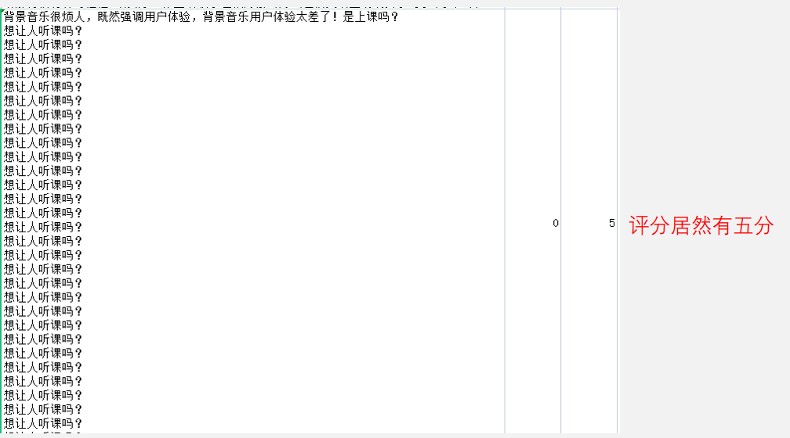

# 一种针对中国大学MOOC课程的新评分体系

### 汇报人：10225101535徐翔宇

## 一、前言


​	MOOC是现代大学生获取网络公关课程的重要渠道，对于MOOC的评价，有人这样说：


​	尽管MOOC上的课程琳琅满目，不乏官方认证的国家精品课程，但是仍然有许多低质量课程在其中滥竽充数。因此我们需要一种方法来判断课程的质量。

​	根据观察中国大学MOOC课程主页的基本信息，我们可以看到其中包含许多信息。比如：课程名、参加课程人数、授课老师、授课学校等信息。这些可能都是我们在选择观看这门课程前会事先浏览的内容。 但是这些基本信息对我们学生的价值并不是那么大。


​	除了成本较高地去听两节试试，还有一种方式，就是点开评论区，看看学生的评价如何。因此我认为一个课的评论十分有价值，可以被视作这个课程优质与否的重要评价标准。本课题将尝试寻找一种对MOOC网上课程的合适评分方法。


## 二、数据收集、整合、清洗

#### 获得评论信息：

​	想要爬取数据，首先我们就要观察课程主页的url是否具有规律。我们以《Python数据分析与展示》为例，它的课程主页url为：


​	可以看出其规律性还是比较明显的，BIT是北理工的简称,1001870002是该网站唯一的课程号，剩余的内容据观察每个课程都是一样的。

​	但是通过此url能爬取的内容并不足够让我们充分了解这门课，因此我们还要进一步挖掘更多数据。


​	令人烦恼的是课程主页的源代码居然并不包含评论数据，为了成功获取课程评论，我参考了这篇博文https://blog.csdn.net/Uncle_wangcode/article/details/129181883。 


​	原来需要调用接口才能实现访问评论，于是依照博文给出的代码做适当修改，我也成功爬取了指定MOOC课程的所有评论以及该评论的点赞数和用户对课程的评分。

```python
#批量下载评论
def extract_digits(string):
    pattern = r'\d+'
    matches = re.findall(pattern, string)
    digits = ''.join(matches)
    return digits

# 请求头定义
HEADERS = {
    "User-Agent": "Mozilla/5.0 (Windows NT 10.0; Win64; x64) AppleWebKit/537.36 (KHTML, like Gecko) Chrome/105.0.0.0 Safari/537.36"
}


# 获取课程参与人数和评论
def get_course_participate_comment(courseID):
    # session 实例化
    session = requests.session()
    # 慕课主页url
    index_url = "https://www.icourse163.org/"
    # 慕课主页发起请求，获取后面需要的csrfKey
    index_res = session.get(index_url, headers=HEADERS)
    # 获取csrfKey
    key = index_res.cookies.get("NTESSTUDYSI")

    # 详细课程url
    course_url = "https://www.icourse163.org/course/"+courseID+"?from=searchPage&outVendor=zw_mooc_pcssjg_"
    course_res = session.get(url=course_url,headers=HEADERS)
    # 获取课程参与人数
    deal = re.compile(r'enrollCount : "(.*?)"')
    result = deal.findall(course_res.text)
    participate_person = result[0]

    #课程评论url

    comment_url = f"https://www.icourse163.org/web/j/mocCourseV2RpcBean.getCourseEvaluatePaginationByCourseIdOrTermId.rpc?csrfKey={key}"
    headers = {
        "User-Agent": "Mozilla/5.0 (Windows NT 10.0; Win64; x64) AppleWebKit/537.36 (KHTML, like Gecko) Chrome/105.0.0.0 Safari/537.36",
        "referer": "https://www.icourse163.org/course/"+courseID+"?from=searchPage&outVendor=zw_mooc_pcssjg_",
    }

    # 写入文本文件中
    with open("preview\\"+courseID + ".csv", mode="w", encoding="utf-8", newline="") as f:
        writer = csv.writer(f)
        writer.writerow([ "评论内容", "点赞数", "评分"])  # Write header row

        # 获取所有评论数
        for i in range(1, 80):
            param = {
                "courseId": extract_digits(courseID),
                "pageIndex": i,
                "pageSize": "20",
                "orderBy": "3"
            }
            comment_res = session.post(url=comment_url, data=param, headers=headers)
            data = json.loads(comment_res.text)
            for count in range(len(data["result"]["list"])):
                agreecounts = data["result"]["list"][count]["agreeCount"]
                mark = data["result"]["list"][count]["mark"]
                content = data["result"]["list"][count]["content"]
                writer.writerow([content, agreecounts, mark])
            print("数据写入完毕！")
```

​	到这里，似乎对于普通学生来说，想要获得课程的全部可参考信息已经足够，只要看几条有价值的评论即可。但是本课题目的在于找到一种通用的课程评价方式，因此我还需要更多信息。

#### 爬取全站评论：

​	前面我们已知每个课程都有唯一的课程ID，并且我们捕获课程评论的方式也是通过课程ID来实现的。那么接下来的任务就是获得课程ID，但是由于MOOC的页面使用ajax技术动态刷新且网页源代码中同样不具有信息需要调用接口，因此这部分我偷懒使用了网络上已有的课程ID数据。但是评论内容都是自己爬取的！


#### 数据整合与清洗：

一、清洗所有课程的基本信息，如开设课程的学校、老师、学生人数、课程ID等。这里的数据是不包括评论数据的课程基本内容。

```python
csv_file = 'course_info\\all_course.csv'
df = pd.read_csv(csv_file, encoding='utf-8')
df = df.drop(columns=df.columns[0])  # 删除第一列
df = df.drop_duplicates()  # 去除重复行
df=df.drop_duplicates(subset=['courseID'], keep='last')
df.to_csv(csv_file, index=False)

pd.set_option('display.max_colwidth', 20)
df.head(10)
```


二、对每一个课程的评论清洗、去除评论内容中的无效信息，包括删除重复行、处理缺失数据、清理评论内容中的特殊字符和空白等。

```python
def process_csv(csv_file):
    try:
        df = pd.read_csv(csv_file, encoding='utf-8')

        # 删除重复行
        df = df.drop_duplicates()

        # 删除缺失数据行
        df = df.dropna()

        df.to_csv(csv_file, index=False)

        df['评论内容'] = df['评论内容'].str.replace('\r|\n', '')
        
        df['评论内容'] = df['评论内容'].str.strip()

        df['评论内容'] = df['评论内容'].str.replace('^[0-9]*$', '')

        df['评论内容'] = df['评论内容'].str.replace(r'^(.)\1*$', '')

    except pd.errors.EmptyDataError:
        print(f"No columns to parse from file: {csv_file}")#大概是没评论的课吧

folder_path = 'preview'
filenames = os.listdir(folder_path)
for filename in filenames:
    if filename.endswith('.csv'):
        file_path = os.path.join(folder_path, filename)
        process_csv(file_path)
```


## 三、多维度概览

​	这里我们先将所有评论内容汇总到一起，从多角度看一下所有课的评论，方便后续统一处理。

```python
all_data = pd.DataFrame(columns=['评论内容', '点赞数', '评分'])

for filename in filenames:
    if filename.endswith('.csv'):
        file_path = os.path.join(folder_path, filename)
        try:
            df = pd.read_csv(file_path)
            all_data = all_data.append(df, ignore_index=True)
        except:
            pass
all_data.to_csv('all_data.csv', index=False)
```


#### 统计点赞数和评分：

​	在爬取数据的过程中我注意到，其实用户评论课程的同时会为课程打分，用户对课程的打分是衡量课程质量一个重要的指标。

```python
plt.figure(figsize=(10, 8))
plt.pie([sum(np.ceil(all_data['评分']) == i) for i in range(1, 6)], labels=[f'{i}星' for i in range(1, 6)], autopct='%1.1f%%', colors=['#ff9999','#66b3ff','#99ff99','#ffcc99', '#c2c2f0'])
plt.title('评分的饼图')
plt.show()
```


​	同时用户也可以对认同的评论点赞，因此评论的点赞数也侧面反映该观点的受支持程度。


​	在饼图中可以看到，所有课程中85.5%评论的点赞数都为0，高赞评论只占很小一部分，但是高赞评论作为很多学生都认同的观点，对于帮助我们了解课程质量是非常重要的。

​	可以再看看散点图，可以看出各评分的评论都有大量点赞数，但是结合之前的统计结果，似乎用户还是更喜欢含蓄的评价。

```python
x = all_data['点赞数']
y = np.ceil(all_data['评分']).astype(int) 

# 根据点赞数和评分的值为数据点着色
colors = all_data['点赞数']

plt.scatter(x, y, c=colors, cmap='viridis')
plt.colorbar(label='点赞数')

plt.xlabel('点赞数')
plt.ylabel('评分')
plt.title('点赞数与评分的分布情况')
plt.yticks(np.arange(min(y), max(y)+1, 1))

plt.show()
```


#### 评论长度分布：

​	我们可以再看一下用户的评论长度的分布，因为评论长度通常代表用户在写这条评论时情感投入。

```python
# 读取CSV文件
df = pd.read_csv('all_data.csv')

# 获取item列的内容
items = df['评论内容']

# 统计每个item的字符数，并计算每个长度对应的项目数量
item_lengths = items.str.len()
length_counts = item_lengths.value_counts().sort_index()

# 绘制分布图
plt.bar(length_counts.index, length_counts.values)
plt.xlabel('Item Length')
plt.ylabel('Count')
plt.title('Distribution of Item Lengths')
plt.xlim(0, 200)
plt.show()

average_length = item_lengths.mean()
median_length = item_lengths.median()

# 打印结果
print("Average Length:", average_length)
print("Median Length:", median_length)
```


​	我们可以看到评论的平均长度在19，中位数在11。说明大部分评论都比较简短。


#### 分词:

​	但是有时我们读取内容需要依靠分词然确认语句含义，因此统计有效词也很有意义。现在我们已经得到了将评论内容分词的结果，接下来我们再统计一下分词后词语数量的分布。 下面这段函数的作用是将评论内容进行分词处理，同时去除停用词部分。(停用词是指在文本中频繁出现但对文本分析任务没有实质性帮助的常见词语。停用词通常是一些常见的功能词、代词、介词和连词等)

```python
# 读取CSV文件
df = pd.read_csv('tokenized_data.csv')

# 定义一个函数来统计短语数量
def count_phrases(text):
    if pd.isnull(text):  # 检查是否为缺失值
        return 0
    phrases = text.split()
    return len(phrases)

# 对分词结果应用统计函数，得到短语数量列
df['短语数量'] = df['分词结果'].apply(count_phrases)

df.to_csv('tokenized_data.csv', index=False)

# 统计每个短语数量对应的分词结果数量
phrase_counts = df['短语数量'].value_counts().sort_index()

# 绘制短语数量分布图
plt.bar(phrase_counts.index, phrase_counts.values)
plt.xlim(0, 40)
plt.xlabel('短语数量')
plt.ylabel('分词结果数量')
plt.title('分词结果中短语数量分布')
plt.show()

average_length = df['短语数量'].mean()
median_length = df['短语数量'].median()

# 打印结果
print("Average Length:", average_length)
print("Median Length:", median_length)
df = pd.read_csv('all_data.csv')

def get_custom_stopword(stop_word_file):
    with open(stop_word_file, encoding='utf-8') as f:
        stop_word = f.read()

    stop_word_list = stop_word.split("\n")
    custom_stopword = [i for i in stop_word_list]
    return custom_stopword

stopwords = get_custom_stopword("stopwords.txt")

def tokenize_text(text):
    tokens = jieba.lcut(text)
    tokens_without_stopwords = [token for token in tokens if token not in stopwords]
    return " ".join(tokens_without_stopwords)

df['分词结果'] = df['评论内容'].apply(tokenize_text)

# Save the modified DataFrame to a CSV file
df.to_csv('tokenized_data.csv', index=False)
```


​	可以看到分词数量下降的很厉害，平均只有4.28。也就是说其实评论包含的情感很简单。

​	这里尝试提取一下每个课程评论区最常被提到的十个词，我们可以借此获得一些课程的关键词。

```python
def get_custom_stopwords(stop_word_file):
    with open(stop_word_file, encoding='utf-8') as f:
        stop_word = f.read()

    stop_word_list = stop_word.split("\n")
    custom_stopwords = [i for i in stop_word_list]
    return custom_stopwords

def tokenized(file_path, stopwords):
    df = pd.read_csv(file_path)  # 读取CSV文件

    def tokenize_text(text):
        tokens = jieba.lcut(text)  # 使用结巴分词进行分词
        tokens_without_stopwords = [token for token in tokens if token not in stopwords]  # 去除停用词
        chinese_tokens = [token for token in tokens_without_stopwords if re.match(r'^[\u4e00-\u9fff]+$', token)]
        return chinese_tokens

    # df = df.sort_values('点赞数', ascending=False)
    # df = df.head(20)

    df['tokens'] = df['评论内容'].apply(tokenize_text)  # 对评论内容进行分词并保存到新的列中

    # 将分词结果展开为一个列表
    all_tokens = [token for tokens in df['tokens'] for token in tokens]

    # 计算词频
    word_frequencies = pd.Series(all_tokens).value_counts()

    # 获取出现频率最高的前五个词
    top_10_words = word_frequencies[:10].index.tolist()

    top_10_words_str = ', '.join(top_10_words)

    return top_10_words_str


stopwords = get_custom_stopwords("stopwords.txt")  # 获取自定义停用词列表

all_course_path = 'new_all_course.csv'
preview_folder_path = 'preview\\'

# 读取 "all_course.csv" 文件
df_all_course = pd.read_csv(all_course_path)

# 逐行处理
for index, row in df_all_course.iterrows():
    link = row['link']
    link_parts = link.split('/')[-1]
    csv_file_name = link_parts + '.csv'
    csv_file_path = os.path.join(preview_folder_path, csv_file_name)

    # 调用计算函数
    try:
        top_10_words = tokenized(csv_file_path,stopwords)
        df_all_course.loc[index, 'top_10_words'] = top_10_words
    except:
        pass

# 重置 DataFrame 的索引
df_all_course=df_all_course.drop_duplicates(subset=['courseID'], keep='last')
df_all_course = df_all_course.reset_index(drop=True)
df_all_course.to_csv('new_all_course.csv', index=False)
```

根据关键词提取我实现了下面的功能，用于根据关键词匹配关键词重复度最高的课为可能感兴趣的课：

```python
top_10_words_str=tokenized(df,stopwords)
    data_df = pd.read_csv('new_all_course.csv')
    x = 10  # 初始关联词数量
    matching_rows = None
    while x >= 0 and (matching_rows is None or matching_rows.empty):
        matching_rows = data_df[(data_df['courseID'] != courseID) & (data_df['top_10_words'].astype(str).apply(lambda row: sum(1 for word in row.split(', ') if word.strip() in top_10_words_str.split(', '))) >= x)]
        x -= 1
    matching_rows_links_str = '\n'.join(matching_rows['link'].astype(str))
```


## 四、制定量化规则

​	我将统计平均评分、含权评分、和各评分的评论数、评分的方差含权重的均分的计算方法：

#### 含权重的均分的计算方法：

##### 	最终评分：

##### 	权重：

​	点赞数说明了该评论的受认可程度，但是点赞对课程的褒贬程度我认为不应该超过评论，因此我希望以此方式来保证高赞评论权重的合理性.

​	评分情感：在目前阶段，我选择将高于3的评论视作正面评论，低于3的视作负面评论，其余则为中性评论。因此计算评分时我将源数据减去期望3再乘以权重以此保证权重可以起到正确的效果。但是在后续，我会选择一些其他方法来验证该用户的评论与其评分是否相符来避免用户评分错误的问题出现。

​	评分的方差则是为了考察学生对课程的评价是否存在两极分化的情况，但是这里并没有将其纳入评分标准。

```python
def calculate_likes_weight(likes):
    return (likes+1) / math.log2(likes + 2)

def calculate_likes_right(csv_file):
    try:
        df = pd.read_csv(csv_file, encoding='utf-8')

        # 添加权值列
        df['点赞权值'] = df['点赞数'].apply(calculate_likes_weight)
        #评分情感
        df['评分情感'] = df['评分'].apply(lambda x: 1 if x > 3 else (-1 if x < 3 else 0))

        df.to_csv(csv_file, index=False)

    except:
        pass

for filename in filenames:
    if filename.endswith('.csv'):
        file_path = os.path.join(folder_path, filename)
        calculate_likes_right(file_path)
```

​	可以找一个课看看结果

```python
df = pd.read_csv('preview\BIT-20018.csv', encoding='utf-8')
pd.set_option('display.max_colwidth', 20)
df.head(10)
```

​	可以看到点赞数高的课会被给予较高权值，但是点赞为0的根据含权重的均分的计算方法也不受影响。


​	下面的代码是将每个课程的评分等内容插入总表（包含所有课的基本信息但不包含评论）中

```python
def calculate_infos(csv_file):
    try:
        df = pd.read_csv(csv_file, encoding='utf-8')

        # 计算含权评分
        df['含权评分'] = (df['评分'] - 3) * df['点赞权值']

        # 计算∑权重*(评分-3)/评论数的结果
        weighted_rating = (df['含权评分'].sum()) / len(df)

        # 计算各评分的评论数
        rating_counts = df['评分'].value_counts().sort_index()
        df['评论数'] = df['评分'].map(rating_counts)

        # 计算评分的方差
        ratings_variance = np.var(df['评分'])

        # 返回计算结果
        return df['评分'].mean(), weighted_rating, rating_counts, ratings_variance

    except Exception as e:
        #print(f"Error processing file: {csv_file}. Error message: {str(e)}")
        return None, None, None, None

# 获取文件路径
all_course_path = 'course_info\\all_course.csv'
preview_folder_path = 'preview\\'

# 读取 "all_course.csv" 文件
df_all_course = pd.read_csv(all_course_path)

# 逐行处理
for index, row in df_all_course.iterrows():
    link = row['link']
    link_parts = link.split('/')[-1]
    csv_file_name = link_parts + '.csv'
    csv_file_path = os.path.join(preview_folder_path, csv_file_name)

    # 调用计算函数
    mean_rating, weighted_rating, rating_counts, ratings_variance = calculate_infos(csv_file_path)

    if mean_rating is not None:
        # 将计算结果添加到 "all_course.csv" 中的相应行
        df_all_course.loc[index, '平均评分'] = mean_rating
        df_all_course.loc[index, '含权评分'] = weighted_rating
        df_all_course.loc[index, '评分的方差'] = ratings_variance

        # 将各评分的评论数添加为新的列
        # 将各评分的评论数添加为新的列（包括缺失的评分）
        for rating in range(5, 0, -1):
            column_name = f'评分{rating}的评论数'
            count = rating_counts.get(rating, 0)
            df_all_course.loc[index, column_name] = count
    else:
        # 删除对应的行
        df_all_course = df_all_course.drop(index)

# 重置 DataFrame 的索引
df_all_course=df_all_course.drop_duplicates(subset=['courseID'], keep='last')
df_all_course = df_all_course.reset_index(drop=True)
df_all_course.to_csv('new_all_course.csv', index=False)
```

​	我们可以了解一下含权评分最低的课是什么样的。低质量的课看似糟糕程度不严重，且评价没有很差的课，但是了解课程主页。。。一言难尽。

```python
# 读取CSV文件
df = pd.read_csv('new_all_course.csv')

# 根据某一列的值进行排序
df_sorted = df.sort_values('含权评分')

# 打印结果
print(df_sorted[['courseID','含权评分']].head(20))
```


​	但是值得注意的是，有些用户的对课程的评价显然属于负面评价，但是评分确很高，推测是用户评价时忘记评分，因此我们后面会尝试使用文本情感分析模型去推测用户的评价。




#### 课程对比：

生成词云的代码：

```python
def generate_wordcloud(filename):
    path = 'preview\\'+filename+'.csv'
    column_name = '评论内容'

    data = pd.read_csv(path, usecols=[column_name])
    txt = ' '.join(data[column_name].tolist())
    string = ' '.join(jieba.lcut(txt))

    def get_custom_stopword(stop_word_file):
        with open(stop_word_file, encoding='utf-8') as f:
            stop_word = f.read()

        stop_word_list = stop_word.split("\n")
        custom_stopword = [i for i in stop_word_list]
        return custom_stopword

    stopwords = get_custom_stopword("stopwords.txt")
    w = WordCloud(width=1000,
                  height=700,
                  background_color='white',
                  font_path='C:/Windows/SIMLI.TTF',
                  scale=15,
                  stopwords=stopwords,
                  contour_width=5,
                  contour_color='red')

    w.generate(string)
    w.to_file(filename+'_wordcloud.png')
    img1 = mpimg.imread(filename+'_wordcloud.png') # 读取和代码处于同一目录下的 lena.png
    #结果展示
    plt.rcParams['font.sans-serif'] = ['SimHei']  # 中文乱码
    plt.subplot(121)
    #imshow()对图像进行处理，画出图像，show()进行图像显示
    plt.figure(figsize=(10, 8))
    #不显示坐标轴
    plt.axis('off')
    plt.imshow(img1)

```


##### 	高分课：


##### 低分课：


​	可以看到评分差距很大的课其评论在词云上体现的并不是特别明显。但是还是有不少的差距的。


## 五、使用深度学习模型提高数据准确度

#### SnowNLP


​	首先直接使用非常方便的snownlp库来处理文本内容。

```python
df = pd.read_csv('preview/HIT-353001.csv')
def get_sentiment_cn(text):
    s = SnowNLP(text)
    return s.sentiments
df["sentiment"] = df['评论内容'].apply(get_sentiment_cn)
print(df)
```


​	由于SnowNLP语料库本身是基于购物评论内容，很遗憾直接使用SnowNLP模型效果并不理想，其不能识别出评论中的不满情感。所以我们应当使用合适的数据集来训练模型达到效果。

​	但是采用人工标注对于我们的结课作业显然是不合理的。


​	所以我们应当使用合适的数据集来训练模型达到效果。但是采用人工标注对于我们的结课作业显然是不合理的。很幸运，经过授权，我获得了本校老师在其研究中标注的数据集(但是数据集本身比较小，对于模型的训练效果经过实测并不是特别好，但其实我看到有不少师范类学校做过类似的评论情感标注，期待越来越多的数据集能被公开使用！)

​	接下来使用在线学习课程平台课程评论文本情感分析数据集.tab来作为训练数据。这里使用snownlp作为训练模型。我将数据集中的情感简单地分为正向和负向。正面情绪：高兴、希望、放松、兴趣。负面情绪：失望、气愤、焦虑、厌倦、羞愧。

```python
def process_item(df):
    df['item'] = df['item'].str.split('；', n=1, expand=True)[0]
    df['item'] = df['item'].str.replace('\r|\n', '')
    df['item'] = df['item'].str.strip()
    df['item'] = df['item'].str.replace('^[0-9]*$', '')
    df['item'] = df['item'].str.replace(r'^(.)\1*$', '')


# 读取 Excel 文件
df = pd.read_excel('anotation_result.xlsx')

# 将情感映射为正向或负向
positive_emotions = ['高兴', '希望', '放松', '兴趣']
negative_emotions = ['失望', '气愤', '焦虑', '厌倦', '羞愧']

df['sentiment'] = df['emotion'].apply(lambda x: 1 if x in positive_emotions else 0)

# 计算训练集和测试集的切分点
split_index = int(0.8 * len(df))

# 获取训练集和测试集数据
train_df = df[:split_index]
test_df = df[split_index:]
process_item(train_df)
process_item(test_df)

positive_train_texts = train_df[train_df['sentiment'] == 1]['item'].tolist()

with open('positive_train_dataset.txt', 'w', encoding='utf-8') as f:
    for text in positive_train_texts:
        f.write(f'{text}\n')

# 保存负向情感训练集的 item 到文本文件
negative_train_texts = train_df[train_df['sentiment'] == 0]['item'].tolist()

with open('negative_train_dataset.txt', 'w', encoding='utf-8') as f:
    for text in negative_train_texts:
        f.write(f'{text}\n')

# 保存测试集的 item 和 sentiment 到 Excel 文件
test_texts = test_df['item'].str.split('；', n=1, expand=True)[0].tolist()
test_sentiments = test_df['sentiment'].tolist()

test_data = pd.DataFrame({'item': test_texts, 'sentiment': test_sentiments})

test_data.to_excel('test_dataset.xlsx', index=False)
```

​	接下来就是开始训练了。

```python
#对语料库进行训练，把路径改成相应的位置。
sentiment.train('negative_train_dataset.txt', 'positive_train_dataset.txt') 
#这一步是对上一步的训练结果进行保存，如果以后语料库没有改变，下次不用再进行训练，直接使用就可以了，所以一定要保存，保存位置可以自己决定，但是要把`snownlp/seg/__init__.py`里的`data_path`也改成你保存的位置，不然下次使用还是默认的。
sentiment.save('entiment.marshal')
```

​	然后测试准确度。

```python
#//是转义的方式。表示这里\\是一个普通\字符，不容易出错
text = pd.read_excel(r'test_dataset.xlsx')
#text0读取text数据框的第一列的所有数据
text0=text.iloc[:,0]
senti=[SnowNLP(i).sentiments for i in text0]
newsenti=[]
for i in senti:
    if (i>=0.5):
        newsenti.append(1)
    else:
        newsenti.append(0)
#将新的预测标签增加为text的某一列，所以现在text的第0列为评论文本，第1列为实际标签，第2列为预测标签
text['predict']=newsenti
counts=0
#遍历所有标签，将预测标签和实际标签进行比较，相同则判断正确。
for j in range(len(text.iloc[:,0])): 
    if text.iloc[j,2]==text.iloc[j,1]:
        counts+=1
#输出本次预测的准确率
print(u"准确率为:%f"%(float(counts)/float(len(text))))
```


经过对数据集的分类、划分测试集进行验证后，得到了准确率结果。我想67%并不是一个很好的结果。


#### LSTM：

​	LSTM是一种含有LSTM区块（blocks）或其他的一种类神经网络，文献或其他资料中LSTM区块可能被描述成智能网络单元，因为它可以记忆不定时间长度的数值，区块中有一个gate能够决定input是否重要到能被记住及能不能被输出output。由于独特的设计结构，LSTM适合于处理和预测时间序列中间隔和延迟非常长的重要事件。在NLP领域，LSTM可以用于文本分类、情感分析、机器翻译等任务。通过对文本序列进行建模，LSTM能够捕捉到文本中的长期依赖关系，从而提高模型的准确率。LSTM通过其内部的门控机制，能够有效地处理长序列数据并捕捉序列中的长期依赖关系，因此在各种序列数据建模任务中具有广泛的应用前景。


但是根据本人实验，在小样本训练的情况下，LSTM的识别准确率同样很不理想。这里代码用零时文件存储的，后来被覆盖了，不过不重要。

#### 大样本训练：

​	因此，考虑到网络上对课程评价的情感标注数据集较少，我决定直接使用我爬取的评论数据，寄希望于大量的正确评分的用户可以让模型的准确率尽可能不受影响。

```python
def process_item(df):
    df['评论内容'] = df['评论内容'].str.split('；', n=1, expand=True)[0]
    df['评论内容'] = df['评论内容'].str.replace('\r|\n', '')
    df['评论内容'] = df['评论内容'].str.strip()
    df['评论内容'] = df['评论内容'].str.replace('^[0-9]*$', '')
    df['评论内容'] = df['评论内容'].str.replace(r'^(.)\1*$', '')
    df['评论内容'] = df['评论内容'].apply(remove_illegal_characters)  # 新增代码，移除非法字符

def remove_illegal_characters(text):
    illegal_chars = re.compile(r'[\000-\010]|[\013-\014]|[\016-\037]')  # 匹配非法字符的正则表达式
    return re.sub(illegal_chars, '', text)

# 读取 Excel 文件
df = pd.read_csv('all_data.csv')

df['评分情感'] = df['评分'].apply(lambda x: 1 if x > 3 else (-1 if x < 3 else 0))

# 计算训练集和测试集的切分点
split_index = int(0.9 * len(df))

# 获取训练集和测试集数据
train_df = df[:split_index]
test_df = df[split_index:]
process_item(train_df)
process_item(test_df)

positive_train_texts = train_df[train_df['评分情感'] == 1]['评论内容'].tolist()

with open('positive_train_raw.txt', 'w', encoding='utf-8') as f:
    for text in positive_train_texts:
        f.write(f'{text}\n')

# 保存负向情感训练集的 item 到文本文件
negative_train_texts = train_df[train_df['评分情感'] == -1]['评论内容'].tolist()

with open('negative_train_raw.txt', 'w', encoding='utf-8') as f:
    for text in negative_train_texts:
        f.write(f'{text}\n')

# 保存测试集的 item 和 sentiment 到 Excel 文件
test_texts = test_df['评论内容'].tolist()
test_sentiments = test_df['评分情感'].tolist()

test_data = pd.DataFrame({'评论内容': test_texts, '评分情感': test_sentiments})
test_data['评论内容'] = test_data['评论内容'].apply(remove_illegal_characters)  # 移除非法字符

test_data.to_excel('test_raw.xlsx', index=False)
```

现在如果不考虑用户的评分标错的情况，我们直接根据用户评分来判断评论的情感。并将相关语料放入snopwnlp训练。

```python
#对语料库进行训练，把路径改成相应的位置。
sentiment.train('negative_train_raw.txt', 'positive_train_raw.txt') 
#这一步是对上一步的训练结果进行保存，如果以后语料库没有改变，下次不用再进行训练，直接使用就可以了，所以一定要保存，保存位置可以自己决定，但是要把`snownlp/seg/__init__.py`里的`data_path`也改成你保存的位置，不然下次使用还是默认的。
sentiment.save('entiment.marshal')
# 读取数据
df = pd.read_csv('results.csv')

# 将评论内容列转换为字符串类型
df['评论内容'] = df['评论内容'].astype(str)

# 进行情感预测
df['senti_score'] = df['评论内容'].apply(lambda x: SnowNLP(x).sentiments)

# 根据情感得分进行预测标签的转换
df['predict'] = df['senti_score'].apply(lambda x: 1 if x >= 0.5 else -1)

# 计算准确率
valid_df = df[df['评分情感'] != 0]
accuracy = len(valid_df[valid_df['predict'] == valid_df['评分情感']]) / len(valid_df)

# 输出准确率
print("准确率为: %f" % accuracy)

valid_df.to_csv('valid_df.csv', index=False)

```

​	在大数据量（78万条评论全部训练耗时近一个小时）的训练下，可以看到准确率还是不错的，就是效率有点低，应该是分词用了太久。但是可惜的是用户的真实情感与对课程评分不匹配的情况不能得到去除。而且训练耗时十分久。在后续我们可以看到LTSM在使用更少训练时间的情况下实现了与snownlp几乎相同的匹配度。


​	现在我将所有评论的情感倾向进行预测。以待后续使用。

```python
def predict(data_path):
        output_column = 'sentiment_prediction_snownlp'  # 新列的名称
        sentiment_column = 'sentiment_snownlp'  # 新列的名称

        # 读取CSV文件
        df = pd.read_csv(data_path)

        # 将情感倾向预测结果保存到新列中
        df[output_column] = df['评论内容'].apply(lambda x: SnowNLP(x).sentiments)

        # 根据情感得分进行预测标签的转换
        df[sentiment_column] = df[output_column].apply(lambda x: 1 if x > 0.6 else (-1 if x < 0.4 else 0))

        # 保存更新后的CSV文件
        df.to_csv(data_path, index=False)


if __name__ == '__main__':
    folder_path = 'preview'
    filenames = os.listdir(folder_path)
    with concurrent.futures.ThreadPoolExecutor() as executor:
        # 提交每个文件的预测任务给线程池
        future_to_file = {executor.submit(predict, os.path.join(folder_path, filename)): filename for filename in filenames if filename.endswith('.csv')}

        # 获取结果
        for future in concurrent.futures.as_completed(future_to_file):
            file_path = future_to_file[future]
            try:
                future.result()
            except Exception as e:
                print(f"Failed to predict file: {file_path}, Error: {str(e)}")
```


​	接下来，在中等数据量（五万条正向情感评论和一万五千条负向情感评论）的训练下，可以看到准确率实现了与snownlp几乎相同。并且时间只需其1/3左右。

​	模型：

```python
class SentimentNet(nn.Module):
    device = torch.device('cuda') if torch.cuda.is_available() else torch.device("cpu")

    def __init__(self, vocab_size, input_dim, hid_dim, layers, output_dim):
        super(SentimentNet, self).__init__()
        self.n_layers = layers
        self.hidden_dim = hid_dim
        self.embeding_dim = input_dim
        self.output_dim = output_dim
        drop_prob = 0.5

        self.lstm = nn.LSTM(self.embeding_dim, self.hidden_dim, self.n_layers,
                            dropout=drop_prob, batch_first=True).to(self.device)

        self.fc = nn.Linear(in_features=self.hidden_dim, out_features=self.output_dim).to(self.device)
        self.sigmoid = nn.Sigmoid()
        self.dropout = nn.Dropout(drop_prob)

        self.embedding = nn.Embedding(vocab_size, self.embeding_dim).to(self.device)

    def forward(self, x, hidden):
        x = x.long().to(self.device)
        embeds = self.embedding(x).to(self.device)

        lstm_out, hidden = self.lstm(embeds, hidden)
        out = self.dropout(lstm_out)
        out = self.fc(out).to(self.device)
        out = self.sigmoid(out)
        out = out[:, -1, :]
        out = out.squeeze()
        out = out.contiguous().view(-1)
        return out, hidden

    def init_hidden(self, batch_size):
        hidden = (torch.zeros(self.n_layers, batch_size, self.hidden_dim).to(self.device),
                  torch.zeros(self.n_layers, batch_size, self.hidden_dim).to(self.device))
        return hidden
```

​	训练：

```python
if __name__ == '__main__':

    data_path = 'new_all_data.csv'
    df = pd.read_csv(data_path)
    df = df.sample(frac=1, random_state=1)

    # 只取打乱后数据的前10%
    #df = df.head(int(df.shape[0] * 0.01))

        # 选择评分情感为1和-1的数据
    df = df[df['评分情感'].isin([1, -1])]

    # 分别选择评分情感为1和-1的5000条数据
    positive_df = df[df['评分情感'] == 1].sample(n=50000, random_state=1)
    negative_df = df[df['评分情感'] == -1].sample(n=15000, random_state=1)

    # 合并数据
    df = pd.concat([positive_df, negative_df])


    x = df['评论内容']
    y = df['评分情感']


    texts_cut = [jieba.lcut(one_text) for one_text in x]

    label_set = set()
    for label in y:
        label_set.add(label)
    label_set = np.array(list(label_set))

    labels_one_hot = []
    for label in y:
        label_zero = np.zeros(len(label_set))
        label_zero[np.in1d(label_set, label)] = 1
        labels_one_hot.append(label_zero)
    labels = np.array(labels_one_hot)

    num_words = 3000
    tokenizer = Tokenizer(num_words=num_words)
    tokenizer.fit_on_texts(texts=texts_cut)
    num_words = min(num_words, len(tokenizer.word_index) + 1)

    sentence_len = 5

    texts_seq = tokenizer.texts_to_sequences(texts=texts_cut)
    texts_pad_seq = pad_sequences(texts_seq, maxlen=sentence_len, padding='post', truncating='post')

    # 拆分训练集和测试集
    x_train, x_test, y_train, y_test = train_test_split(texts_pad_seq, labels, test_size=0.2, random_state=1)

    train_dataset = TensorDataset(torch.from_numpy(x_train), torch.from_numpy(y_train))
    test_dataset = TensorDataset(torch.from_numpy(x_test), torch.from_numpy(y_test))

    batch_size = 32

    train_loader = DataLoader(train_dataset, batch_size=batch_size, shuffle=True)
    test_loader = DataLoader(test_dataset, batch_size=batch_size, shuffle=True)

    model = SentimentNet(num_words, 256, 128, 8, 2)

    lr = 0.0001
    optimizer = torch.optim.Adam(model.parameters(), lr=lr)
    criterion = nn.BCELoss()
    device = torch.device('cuda') if torch.cuda.is_available() else torch.device("cpu")

    epochs = 32
    step = 0
    epoch_loss_list = []
    model.train()  # 开启训练模式

    for epoch in range(epochs):
        epoch_loss = 0
        for index, (x_train, y_train) in enumerate(train_loader):
            cur_batch = len(x_train)
            h = model.init_hidden(cur_batch) # 初始化第一个Hidden_state

            x_train, y_train = x_train.to(device), y_train.to(device)
            step += 1  # 训练次数+1

            x_input = x_train.to(device)
            model.zero_grad()

            output, h = model(x_input, h)
            output=output.to(device)
            # 计算损失
            loss = criterion(output, y_train.float().view(-1))
            loss.backward()

            nn.utils.clip_grad_norm_(model.parameters(), max_norm=5)
            optimizer.step()
            epoch_loss += loss.item()

        print("Epoch: {}/{}...".format(epoch + 1, epochs),
              "Step: {}...".format(step),
              "Loss: {:.6f}...".format(epoch_loss))

        epoch_loss_list.append(epoch_loss)

    # 保存模型
    torch.save(model.state_dict(), 'model.pth')

```

​	测试：

```python
    model.eval()
    loss = 0
    for data in tqdm(test_loader):
        x_val, y_val = data
        x_val, y_val = x_val.to(device), y_val.to(device)

        h = model.init_hidden(len(x_val))  # 初始化第一个Hidden_state

        x_input = x_val.long()
        x_input = x_input.to(device)
        output, h = model(x_input, h)
        output=output.to(device)
        loss += criterion(output, y_val.float().view(-1))

    print("test Loss: {:.6f}...".format(loss))

    test_text_cut = [jieba.lcut("这老师只会读ppt，真的不行，垃圾"),
                     jieba.lcut("讲得好详细"),
                     jieba.lcut("根本听不懂"),
                     jieba.lcut("五颗星，讲得深入浅出，太棒了，很喜欢老师，谢谢")]

    
    test_seq = tokenizer.texts_to_sequences(texts=test_text_cut)
    print(test_seq)
    test_pad_seq = pad_sequences(test_seq, maxlen=sentence_len, padding='post', truncating='post')
    h = model.init_hidden(len(test_pad_seq))

    output, h = model(torch.tensor(test_pad_seq), h)
    print(output.view(-1,2))

    for label in label_set:
        print(label)

    x = [epoch + 1 for epoch in range(epochs)]
    plt.plot(x, epoch_loss_list)

    plt.xlim(0, 32)
    plt.ylim(0, 1000)
    plt.show()

    tokenizer_file = 'tokenizer.pkl'
    with open(tokenizer_file, 'wb') as f:
        pickle.dump(tokenizer, f)

```


​	下面的代码是将所有的课程评论使用LSTM进行预测

```python
num_words = 3000
model = SentimentNet(num_words, 256, 128, 8, 2)  # 创建一个新的模型实例
model.load_state_dict(torch.load('model.pth'))

# 定义函数来进行分词和情感预测
def process_comments(comments):

    sentence_len = 5

    # 进行分词和去除停用词
    comments_cut = [jieba.lcut(text) for text in comments]

    tokenizer_file = 'tokenizer.pkl'

    # 加载词汇表文件
    with open(tokenizer_file, 'rb') as f:
        tokenizer = pickle.load(f)


    # 将分词后的文本转换为序列
    test_seq = tokenizer.texts_to_sequences(texts=comments_cut)

    # 对序列进行填充
    test_pad_seq = pad_sequences(test_seq, maxlen=sentence_len, padding='post', truncating='post')

    # 初始化隐藏层
    h = model.init_hidden(len(test_pad_seq))

    # 获取情感倾向预测结果
    output, h = model(torch.tensor(test_pad_seq), h)

    # 返回情感倾向预测结果
    return output.view(-1, 2)

def predict(data_path):
    try:
        output_column = 'sentiment_prediction_LSTM'  # 新列的名称
        sentiment_column = 'sentiment_LSTM'  # 新列的名称

        # 读取CSV文件
        df = pd.read_csv(data_path)

        # 提取评论列
        comments = df['评论内容']

        # 处理评论并获取情感倾向预测结果
        predictions = process_comments(comments)

        # 将情感倾向预测结果保存到新列中
        df[output_column] = predictions.detach().cpu().numpy().tolist()

        # 添加"sentiment"列
        df[sentiment_column] = np.where(predictions.detach().cpu()[:, 0] > 0.6, 1, np.where(predictions.detach().cpu()[:, 0] < 0.4, -1, 0))

        # 保存更新后的CSV文件
        df.to_csv(data_path, index=False)
    except:
        pass

if __name__ == '__main__':
    folder_path = 'preview'
    filenames = os.listdir(folder_path)
    with concurrent.futures.ThreadPoolExecutor() as executor:
        # 提交每个文件的预测任务给线程池
        future_to_file = {executor.submit(predict, os.path.join(folder_path, filename)): filename for filename in filenames if filename.endswith('.csv')}

        # 获取结果
        for future in concurrent.futures.as_completed(future_to_file):
            file_path = future_to_file[future]
            try:
                future.result()
            except Exception as e:
                print(f"Failed to predict file: {file_path}, Error: {str(e)}")
```


#### baidu.api：

​	此外，我还实现了用百度提供的情感分析API对评论的情感倾向进行预测，但是调用api的时间成本很高。并且api运行的调用次数有限，因此我这里并没真正地使用它预测所有评论。

```python
API_KEY = "KWtdCiEoAUjKta6xdO0F8MPp"
SECRET_KEY = "ZwInRIbOV5j5PUhyWL3xbgm4qg9Y503O"

def baidu_predict(comment):
        
    url = "https://aip.baidubce.com/rpc/2.0/nlp/v1/sentiment_classify?charset=UFT-8&access_token=" + get_access_token()
    
    payload = json.dumps({
        "text": comment
    })
    headers = {
        'Content-Type': 'application/json',
        'Accept': 'application/json'
    }
    
    response = requests.request("POST", url, headers=headers, data=payload)
    try:
        response_json = response.json()
        positive_prob = response_json['items'][0]['positive_prob']
        return(positive_prob)
    except (KeyError, IndexError):
        print("Unable to extract positive_prob from the response.")
    

def get_access_token():
    url = "https://aip.baidubce.com/oauth/2.0/token"
    params = {"grant_type": "client_credentials", "client_id": API_KEY, "client_secret": SECRET_KEY}
    return str(requests.post(url, params=params).json().get("access_token"))


```


#### 	综合预测：

​	原先我的设想是我将用户主动填写的评分代表的情感与我用snownlp和LTSM模型预测的结果作比较，如果三者结果一致，那么我认为评分的情感是准确的，但是如果不一致，我会调用百度提供的情感分析api，输入这条评论的内容返回一个预测结果，再四者比较，只要其中有三个是一致的，那么就把这个值作为最后预测情感结果，如果不一致，会赋值为一个特殊值并且被视为异常值，最后评价课程时这条评论不会被纳入考量范围，但是这种情况比较少，因为预测模型最后的准确度都不错并且用户主动填写的评分也并没有那么多出错的情况。

​	但是如此处理十分耗时，经计算如果判断完所有评论需要花上一整天，但是我的设备主板有问题，不支持如此高的工作负荷。很遗憾。

```python
def compare_sentiments(csv_file):
    # 读取CSV文件
    with open(csv_file, 'r', encoding='utf-8') as file:
        reader = csv.DictReader(file)
        rows = list(reader)

    # 遍历每一行并逐行检查情感值
    for row in rows:
        # 获取当前行的情感值
        sentiment_value = row['评分情感']
        sentiment_snownlp_value = row['sentiment_snownlp']
        sentiment_LTSM_value = row['sentiment']

        # 检查三列的内容是否一致
        if sentiment_value == sentiment_snownlp_value == sentiment_LTSM_value:
            # 如果三列的内容一致，设置check_sentiment列为相同的值
            row['check_sentiment'] = sentiment_value
        else:
            # 如果三列的内容不一致，调用baidu_predict函数获取返回值
            comment = row['评论内容']
            baidu_result = baidu_predict(comment)
            if baidu_result > 0.6:
                baidu_result = 1
            elif baidu_result < 0.4:
                baidu_result = -1
            else:
                baidu_result = 0

            # 检查评分情感、sentiment和sentiment_snownlp与baidu_predict返回值是否一致
            values = [sentiment_value, sentiment_snownlp_value, sentiment_LTSM_value, baidu_result]
            counter = Counter(values)

            most_common = counter.most_common(2)
            if len(most_common) == 1 or (len(most_common) == 2 and most_common[0][1] != most_common[1][1]):
                # 如果出现次数最多的值只有一个，或者出现次数最多的两个值次数不相等，则设置check_sentiment列为出现次数最多的值
                row['check_sentiment'] = most_common[0][0]
            else:
                # 如果无法确定出现次数最多的值，则设置check_sentiment列为2
                row['check_sentiment'] = 2

    # 更新CSV文件的check_sentiment列
    fieldnames = reader.fieldnames + ['check_sentiment']

    with open(csv_file, 'w', encoding='utf-8', newline='') as file:
        writer = csv.DictWriter(file, fieldnames=fieldnames)
        writer.writeheader()
        writer.writerows(rows)

compare_sentiments('preview\BDU-1001765002.csv')

# if __name__ == '__main__':
#     folder_path = 'preview'
#     filenames = os.listdir(folder_path)
#     with concurrent.futures.ThreadPoolExecutor() as executor:
#         # 提交每个文件的预测任务给线程池
#         future_to_file = {executor.submit(compare_sentiments, os.path.join(folder_path, filename)): filename for filename in filenames if filename.endswith('.csv')}

#         # 获取结果
#         for future in concurrent.futures.as_completed(future_to_file):
#             file_path = future_to_file[future]
#             try:
#                 future.result()
#             except Exception as e:
#                 print(f"Failed to predict file: {file_path}, Error: {str(e)}")

if __name__ == '__main__':
    folder_path = 'preview'
    filenames = os.listdir(folder_path)
    with concurrent.futures.ThreadPoolExecutor() as executor:
        # 提交每个文件的预测任务给线程池
        future_to_file = {executor.submit(compare_sentiments, os.path.join(folder_path, filename)): filename for filename in filenames if filename.endswith('.csv')}

        # 获取结果
        for future in concurrent.futures.as_completed(future_to_file):
            file_path = future_to_file[future]
            try:
                future.result()
            except Exception as e:
                print(f"Failed to predict file: {file_path}, Error: {str(e)}")
```

​	这里我退而求其次，只比较了评分代表的情感与我用snownlp和LSTM模型预测的结果，任意两者一致则将其视为正确的评论情感。这个就快多了，并且经过实测，最终效果与调用百度api的方法所实现的效果差别在可接受范围内。

```python
def compare_sentiments(csv_file):
    # 读取CSV文件
    with open(csv_file, 'r', encoding='utf-8') as file:
        reader = csv.DictReader(file)
        rows = list(reader)

    # 遍历每一行并逐行检查情感值
    for row in rows:
        # 获取当前行的情感值
        sentiment_value = row['评分情感']
        sentiment_snownlp_value = row['sentiment_snownlp']
        sentiment_LTSM_value = row['sentiment']

        # 检查三列的内容是否一致
        if sentiment_value == sentiment_snownlp_value or sentiment_value == sentiment_LTSM_value:
            # 如果 sentiment_value 与 sentiment_snownlp_value 或 sentiment_LTSM_value 相同
            row['check_sentiment'] = sentiment_value
        elif sentiment_snownlp_value == sentiment_LTSM_value:
            # 如果 sentiment_snownlp_value 与 sentiment_LTSM_value 相同
            row['check_sentiment'] = sentiment_snownlp_value
        else:
            row['check_sentiment'] = 2

    # 更新CSV文件的check_sentiment列
    fieldnames = reader.fieldnames + ['check_sentiment']

    with open(csv_file, 'w', encoding='utf-8', newline='') as file:
        writer = csv.DictWriter(file, fieldnames=fieldnames)
        writer.writeheader()
        writer.writerows(rows)


if __name__ == '__main__':
    folder_path = 'preview'
    filenames = os.listdir(folder_path)
    with concurrent.futures.ThreadPoolExecutor() as executor:
        # 提交每个文件的预测任务给线程池
        future_to_file = {executor.submit(compare_sentiments, os.path.join(folder_path, filename)): filename for filename in filenames if filename.endswith('.csv')}

        # 获取结果
        for future in concurrent.futures.as_completed(future_to_file):
            file_path = future_to_file[future]
            try:
                future.result()
            except Exception as e:
                print(f"Failed to predict file: {file_path}, Error: {str(e)}")
```

删除check_sentiment为异常值的行保证准确性。

```python
def remove_rows_by_value(csv_file):
    # 读取CSV文件
    df = pd.read_csv(csv_file)

    # 删除指定列值为特定值的行
    df = df[df['check_sentiment'] != 2]

    # 保存修改后的结果到CSV文件
    df.to_csv(csv_file, index=False)

if __name__ == '__main__':
    folder_path = 'preview'
    filenames = os.listdir(folder_path)
    with concurrent.futures.ThreadPoolExecutor() as executor:
        # 提交每个文件的预测任务给线程池
        future_to_file = {executor.submit(remove_rows_by_value, os.path.join(folder_path, filename)): filename for filename in filenames if filename.endswith('.csv')}

        # 获取结果
        for future in concurrent.futures.as_completed(future_to_file):
            file_path = future_to_file[future]
            try:
                future.result()
            except Exception as e:
                print(f"Failed to predict file: {file_path}, Error: {str(e)}")

```


## 六、优化量化规则

​	原先的评分情感只是根据用户评分直接得出的结果，但是经过改良后，我会使用用户评论内容代表的可能真实情感。既然我们已经获得了更准确的用户情感，那么现在让我们来尝试重新评价课程。

```python
def calculate_infos(csv_file):
    try:
        df = pd.read_csv(csv_file, encoding='utf-8')

        # 计算含权评分
        df['标准含权评分'] = abs(df['评分'] - 3) * df['点赞权值'] * df['check_sentiment']

        # 计算∑权重*(评分-3)/评论数的结果
        weighted_rating = (df['标准含权评分'].sum()) / len(df)


        # 返回计算结果
        return weighted_rating

    except Exception as e:
        return None

# 获取文件路径
all_course_path = 'new_all_course.csv'
preview_folder_path = 'preview\\'

# 读取 "all_course.csv" 文件
df_all_course = pd.read_csv(all_course_path)

# 逐行处理
for index, row in df_all_course.iterrows():
    link = row['link']
    link_parts = link.split('/')[-1]
    csv_file_name = link_parts + '.csv'
    csv_file_path = os.path.join(preview_folder_path, csv_file_name)

    try:
        weighted_rating = calculate_infos(csv_file_path)
        df_all_course.loc[index, '标准含权评分'] = weighted_rating
    except:
        pass


# 重置 DataFrame 的索引
df_all_course=df_all_course.drop_duplicates(subset=['courseID'], keep='last')
df_all_course = df_all_course.reset_index(drop=True)
df_all_course.to_csv('new_all_course.csv', index=False)
```

​	看一下新评分体系高评分的课有什么变化

```python
# 读取CSV文件
df = pd.read_csv('new_all_course.csv')

# 根据某一列的值进行排序
df_sorted = df.sort_values('含权评分',ascending=False)

# 打印结果
print(df_sorted[['courseID','含权评分']].head(20))

df_sorted = df.sort_values('标准含权评分',ascending=False)

# 打印结果
print(df_sorted[['courseID','标准含权评分']].head(20))
```


​	我们可以看到评分的情况确实得到了改变，并且改变不大，这是非常好的现象，说明情感预测结果基本接近真实情况，那么对于YouTube，哔哩哔哩上的许多课程资源，只要我们通过接口获得其评论，就能知道课程的优质程度如何了


## 七、面向用户功能整合

​	最后，作为结尾，我整合了之前进行的大部分工作，实现了面向用户的生成课程信息评估的一个程序。可以在我的仓库中看见‘describe.py’。

​	只要用户进入mooc课程主页，将网址复制下来输入到控制台，就能生成一个word文档，包含这该课程的相关数据、评分、排名、和推荐的相似课程。并且处理前的所有评论和经过情感分析标注的评论也会被保存。

```python
# -*- encoding:utf-8 -*-
import pandas as pd
import math
import os
import matplotlib.pyplot as plt # plt 用于显示图片
import matplotlib.image as mpimg # mpimg 用于读取图片
import jieba
from wordcloud import WordCloud
import csv
import matplotlib as  mpl
import matplotlib.pyplot as plt
import warnings
import seaborn as sns
import numpy as np
from sklearn.model_selection import train_test_split
from torch.utils.data import DataLoader, TensorDataset
from tqdm import tqdm
import torch.nn as nn
import torch
from keras.preprocessing.text import Tokenizer
from keras.preprocessing.sequence import pad_sequences
import pickle
import re
import json
import requests
from snownlp import SnowNLP
from collections import Counter
from snownlp import sentiment
import random
from docx import Document
from docx.shared import Inches
from docx.shared import Pt
warnings.filterwarnings('ignore')
from docx.enum.text import WD_PARAGRAPH_ALIGNMENT
from docx.enum.text import WD_BREAK
from model import SentimentNet

# 用来显示中文标签
mpl.rcParams["font.family"] = "SimHei"
# 用来显示负号
mpl.rcParams["axes.unicode_minus"] = False

def extract_digits(string):
    pattern = r'\d+'
    matches = re.findall(pattern, string)
    digits = ''.join(matches)
    return digits

# 请求头定义
HEADERS = {
    "User-Agent": "Mozilla/5.0 (Windows NT 10.0; Win64; x64) AppleWebKit/537.36 (KHTML, like Gecko) Chrome/105.0.0.0 Safari/537.36"
}


# 获取课程参与人数和评论
def get_course_participate_comment(courseID):
    # session 实例化
    session = requests.session()
    # 慕课主页url
    index_url = "https://www.icourse163.org/"
    # 慕课主页发起请求，获取后面需要的csrfKey
    index_res = session.get(index_url, headers=HEADERS)
    # 获取csrfKey
    key = index_res.cookies.get("NTESSTUDYSI")

    # 详细课程url
    course_url = "https://www.icourse163.org/course/"+courseID+"?from=searchPage&outVendor=zw_mooc_pcssjg_"
    course_res = session.get(url=course_url,headers=HEADERS)
    # 获取课程参与人数
    deal = re.compile(r'enrollCount : "(.*?)"')
    result = deal.findall(course_res.text)
    participate_person = result[0]

    #课程评论url

    comment_url = f"https://www.icourse163.org/web/j/mocCourseV2RpcBean.getCourseEvaluatePaginationByCourseIdOrTermId.rpc?csrfKey={key}"
    headers = {
        "User-Agent": "Mozilla/5.0 (Windows NT 10.0; Win64; x64) AppleWebKit/537.36 (KHTML, like Gecko) Chrome/105.0.0.0 Safari/537.36",
        "referer": "https://www.icourse163.org/course/"+courseID+"?from=searchPage&outVendor=zw_mooc_pcssjg_",
    }

    data_list = []


    with open("class_describe\\" + courseID + ".csv", mode="w", encoding="utf-8", newline="") as f:
        writer = csv.writer(f)

        # 获取所有评论数
        for i in range(1, 80):
            param = {
                "courseId": extract_digits(courseID),
                "pageIndex": i,
                "pageSize": "20",
                "orderBy": "3"
            }
            comment_res = session.post(url=comment_url, data=param, headers=headers)
            data = json.loads(comment_res.text)
            for count in range(len(data["result"]["list"])):
                agreecounts = data["result"]["list"][count]["agreeCount"]
                mark = data["result"]["list"][count]["mark"]
                content = data["result"]["list"][count]["content"]
                writer.writerow([content, agreecounts, mark])
                # 存储数据到列表
                data_list.append([content, agreecounts, mark])
            

    # 将列表转换为DataFrame
    df = pd.DataFrame(data_list, columns=["评论内容", "点赞数", "评分"])
    df = df.drop_duplicates()
    df = df.dropna()
    print("数据写入完毕！")
    return df

def calculate_likes_weight(likes):
    return (likes+1) / math.log2(likes + 2)

def calculate_likes_right(df):
        # 添加权值列
        df['点赞权值'] = df['点赞数'].apply(calculate_likes_weight)
        #评分情感
        df['评分情感'] = df['评分'].apply(lambda x: 1 if x > 3 else (-1 if x < 3 else 0))

def get_custom_stopword(stop_word_file):
        with open(stop_word_file, encoding='utf-8') as f:
            stop_word = f.read()

        stop_word_list = stop_word.split("\n")
        custom_stopword = [i for i in stop_word_list]
        return custom_stopword

def tokenized(df, stopwords):

    def tokenize_text(text):
        tokens = jieba.lcut(text)  # 使用结巴分词进行分词
        tokens_without_stopwords = [token for token in tokens if token not in stopwords]  # 去除停用词
        chinese_tokens = [token for token in tokens_without_stopwords if re.match(r'^[\u4e00-\u9fff]+$', token)]
        return chinese_tokens

    df['tokens'] = df['评论内容'].apply(tokenize_text)  # 对评论内容进行分词并保存到新的列中

    # 将分词结果展开为一个列表
    all_tokens = [token for tokens in df['tokens'] for token in tokens]

    # 计算词频
    word_frequencies = pd.Series(all_tokens).value_counts()

    # 获取出现频率最高的前五个词
    top_10_words = word_frequencies[:10].index.tolist()

    top_10_words_str = ', '.join(top_10_words)

    return top_10_words_str

def snownlp_predict(df):
        output_column = 'sentiment_prediction_snownlp'  # 新列的名称
        sentiment_column = 'sentiment_snownlp'  # 新列的名称

        # 将情感倾向预测结果保存到新列中
        df[output_column] = df['评论内容'].apply(lambda x: SnowNLP(x).sentiments)

        # 根据情感得分进行预测标签的转换
        df[sentiment_column] = df[output_column].apply(lambda x: 1 if x > 0.6 else (-1 if x < 0.4 else 0))


# 定义函数来进行分词和情感预测
def process_comments(comments):
    num_words = 3000
    model = SentimentNet(num_words, 256, 128, 8, 2)  # 创建一个新的模型实例
    model.load_state_dict(torch.load('model.pth'))

    sentence_len = 5

    # 进行分词和去除停用词
    comments_cut = [jieba.lcut(text) for text in comments]

    tokenizer_file = 'tokenizer.pkl'

    # 加载词汇表文件
    with open(tokenizer_file, 'rb') as f:
        tokenizer = pickle.load(f)


    # 将分词后的文本转换为序列
    test_seq = tokenizer.texts_to_sequences(texts=comments_cut)

    # 对序列进行填充
    test_pad_seq = pad_sequences(test_seq, maxlen=sentence_len, padding='post', truncating='post')

    # 初始化隐藏层
    h = model.init_hidden(len(test_pad_seq))

    # 获取情感倾向预测结果
    output, h = model(torch.tensor(test_pad_seq), h)

    # 返回情感倾向预测结果
    return output.view(-1, 2)

def LSTM_predict(df):
        output_column = 'sentiment_prediction_LSTM'  # 新列的名称
        sentiment_column = 'sentiment_LSTM'  # 新列的名称

        # 提取评论列
        comments = df['评论内容']

        # 处理评论并获取情感倾向预测结果
        predictions = process_comments(comments)

        # 将情感倾向预测结果保存到新列中
        df[output_column] = predictions.detach().cpu().numpy().tolist()

        # 添加"sentiment"列
        df[sentiment_column] = np.where(predictions.detach().cpu()[:, 0] > 0.6, 1, np.where(predictions.detach().cpu()[:, 0] < 0.4, -1, 0))

def remove_rows_by_value(df):
    # 删除指定列值为特定值的行
    df = df[df['check_sentiment'] != 2]

def compare_sentiments(df):
    # 将DataFrame转换为字典列表
    rows = df.to_dict('records')

    # 遍历每一行并逐行检查情感值
    for row in rows:
        # 获取当前行的情感值
        sentiment_value = row['评分情感']
        sentiment_snownlp_value = row['sentiment_snownlp']
        sentiment_LTSM_value = row['sentiment_LSTM']

        # 检查三列的内容是否一致
        if sentiment_value == sentiment_snownlp_value or sentiment_value == sentiment_LTSM_value:
            # 如果 sentiment_value 与 sentiment_snownlp_value 或 sentiment_LTSM_value 相同
            row['check_sentiment'] = sentiment_value
        elif sentiment_snownlp_value == sentiment_LTSM_value:
            # 如果 sentiment_snownlp_value 与 sentiment_LTSM_value 相同
            row['check_sentiment'] = sentiment_snownlp_value
        else:
            row['check_sentiment'] = 2

    # 将更新后的字典列表转换回DataFrame
    df = pd.DataFrame(rows)
    remove_rows_by_value(df)
    return df

    

def calculate_rank(df):

        # 计算含权评分
        df['标准含权评分'] = abs(df['评分'] - 3) * df['点赞权值'] * df['check_sentiment']

        # 计算∑权重*(评分-3)/评论数的结果
        status_weighted_rating = (df['标准含权评分'].sum()) / len(df)

        # 返回计算结果
        return status_weighted_rating


def get_infos(df,courseID):
    items = df['评论内容']
    item_lengths = items.str.len()
    length_counts = item_lengths.value_counts().sort_index()

    # 绘制分布图
    plt.bar(length_counts.index, length_counts.values)
    plt.xlabel('评论内容长度')
    plt.ylabel('Count')
    plt.title('Distribution of Item Lengths')
    plt.title('评论内容长度分布')
    plt.xlim(0, 100)
    plt.savefig('class_describe/'+courseID+'评论内容长度分布.png', bbox_inches='tight')
    plt.clf() 


    conditions = [df['点赞数'] == 0,
              df['点赞数'] == 1,
              df['点赞数'] == 2,
              df['点赞数'] >= 3]
    labels = ['点赞数为0', '点赞数为1', '点赞数为2', '点赞数为3以上']
    counts = [sum(condition) for condition in conditions]

    plt.figure(figsize=(6, 6))

    # 将counts的值添加到标签中
    labels_with_counts = [f'{label} ({count})' for label, count in zip(labels, counts)]

    plt.pie(counts, labels=labels_with_counts, autopct='%1.1f%%')

    plt.legend(loc='best')

    plt.savefig('class_describe/'+courseID+'点赞数分布情况.png')
    plt.clf() 

    
    labels = [f'{i}星' for i in range(1, 6)]
    sizes = [sum(np.ceil(df['评分']) == i) for i in range(1, 6)]
    colors = ['#ff9999', '#66b3ff', '#99ff99', '#ffcc99', '#c2c2f0']

    plt.pie(sizes, labels=None, autopct='%1.1f%%', colors=colors)
    plt.title('评分的分布')
    # 显示图例
    plt.legend(labels, loc='best')
    # 保存图像
    plt.savefig('class_describe/'+courseID+'评分的分布.png')


    x = df['点赞数']
    y = np.ceil(df['评分']).astype(int) 

    # 根据点赞数和评分的值为数据点着色
    colors = df['点赞数']
    plt.clf() 
    plt.scatter(x, y, c=colors, cmap='viridis')
    plt.colorbar(label='点赞数')
    plt.xlabel('点赞数')
    plt.ylabel('评分')
    plt.title('点赞数与评分的分布的散点图')
    plt.yticks(np.arange(min(y), max(y)+1, 1))
    plt.savefig('class_describe/'+courseID+'点赞数与评分的分布的散点图.png')
    plt.clf() 

    #获取词云
    data = df['评论内容'].head(len(df['评论内容']) // 2)
    txt = ' '.join(data.tolist())
    string = ' '.join(jieba.lcut(txt))
    stopwords = get_custom_stopword("stopwords.txt")
    w = WordCloud(width=500,
                  height=400,
                  background_color='white',
                  font_path='也字工厂瑞云浓楷书.TTF',
                  scale=15,
                  stopwords=stopwords,
                  contour_width=5,
                  contour_color='red'
                  )

    w.generate(string)
    w.to_file('class_describe/'+courseID+'_wordcloud.png')

    #获取关键词
    top_10_words_str=tokenized(df,stopwords)
    data_df = pd.read_csv('new_all_course.csv')
    x = 10  # 初始关联词数量
    matching_rows = None
    while x >= 0 and (matching_rows is None or matching_rows.empty):
        matching_rows = data_df[(data_df['courseID'] != courseID) & (data_df['top_10_words'].astype(str).apply(lambda row: sum(1 for word in row.split(', ') if word.strip() in top_10_words_str.split(', '))) >= x)]
        x -= 1
    matching_rows_links_str = '\n'.join(matching_rows['link'].astype(str))
    
    calculate_likes_right(df)
    snownlp_predict(df)
    LSTM_predict(df)
    df=compare_sentiments(df)
    weighted_rating=calculate_rank(df)

    # 创建标准含权评分区间
    bin_edges = np.arange(-0.5, 7, 0.5)  # 设置评分区间边界

    alldata_df = pd.read_csv('new_all_course.csv')
    # 统计标准含权评分在各区间的数量
    scores = alldata_df['标准含权评分']
    score_counts, _ = pd.cut(scores, bins=bin_edges, include_lowest=True, right=False, retbins=True)
    score_counts = score_counts.value_counts().sort_index()
    # 绘制金字塔图
    plt.clf() 
    plt.figure(figsize=(8, 6))
    # 绘制条形图
    bars = plt.barh(score_counts.index.astype(str)[::-1], score_counts[::-1], color='lightblue')
    # 标记输入值所在的区间
    input_value = weighted_rating  # 替换为你的输入值
    # 显示每个区间的数量
    for i, bar in enumerate(bars):
        plt.text(40+bar.get_width(), i, str(int(bar.get_width())), va='center', ha='right')
    plt.xlabel('数量')
    plt.ylabel('标准含权评分区间')
    plt.title('标准含权评分分布')
    # 给出输入值在标准含权评分的排名
    rank = (scores >= input_value).sum()
    # 显示图形
    plt.savefig('class_describe/'+courseID+'标准含权评分分布.png')

    doc = Document()

    doc.add_picture('class_describe/'+courseID+'评论内容长度分布.png', width=Inches(6), height=Inches(4))
    p1 = doc.add_paragraph()
    p1.alignment = WD_PARAGRAPH_ALIGNMENT.CENTER
    p1.add_run("评论内容长度分布如图").bold = True
    doc.add_paragraph().add_run().add_break(WD_BREAK.PAGE)

    doc.add_picture('class_describe/'+courseID+'点赞数分布情况.png', width=Inches(6), height=Inches(6))
    p2 = doc.add_paragraph()
    p2.alignment = WD_PARAGRAPH_ALIGNMENT.CENTER
    p2.add_run("点赞数分布情况如图").bold = True
    doc.add_paragraph().add_run().add_break(WD_BREAK.PAGE)

    doc.add_picture('class_describe/'+courseID+'评分的分布.png', width=Inches(6), height=Inches(6))
    p3 = doc.add_paragraph()
    p3.alignment = WD_PARAGRAPH_ALIGNMENT.CENTER
    p3.add_run("评分的分布情况如图").bold = True
    doc.add_paragraph().add_run().add_break(WD_BREAK.PAGE)

    doc.add_picture('class_describe/'+courseID+'点赞数与评分的分布的散点图.png', width=Inches(6), height=Inches(6))
    p4 = doc.add_paragraph()
    p4.alignment = WD_PARAGRAPH_ALIGNMENT.CENTER
    p4.add_run("点赞数与评分的分布的散点图如图").bold = True
    doc.add_paragraph().add_run().add_break(WD_BREAK.PAGE)

    doc.add_picture('class_describe/'+courseID+'_wordcloud.png', width=Inches(6), height=Inches(6))
    p5 = doc.add_paragraph()
    p5.alignment = WD_PARAGRAPH_ALIGNMENT.CENTER
    p5.add_run(courseID+"评论词云如图").bold = True
    doc.add_paragraph().add_run().add_break(WD_BREAK.PAGE)
    
    doc.add_picture('class_describe/'+courseID+'标准含权评分分布.png', width=Inches(8), height=Inches(6))
    p7 = doc.add_paragraph()
    p7.alignment = WD_PARAGRAPH_ALIGNMENT.CENTER
    p7.add_run(courseID+"标准含权评分分布如图").bold = True
    doc.add_paragraph().add_run().add_break(WD_BREAK.PAGE)


    p6 = doc.add_paragraph()
    p6.alignment = WD_PARAGRAPH_ALIGNMENT.CENTER
    run = p6.add_run(courseID + "评论的十大关键词:" + top_10_words_str + '\n\n\n本课程在所有课程的质量的排名：' + str(rank))
    run.font.size = Pt(20)

    p8 = doc.add_paragraph()
    p8.alignment = WD_PARAGRAPH_ALIGNMENT.CENTER
    run = p8.add_run('\n\n\n'+courseID + "可能相关的课程:" + matching_rows_links_str )
    run.font.size = Pt(20)


    # 保存文档
    doc.save('class_describe/describe_'+courseID+'.docx')

    
    

if __name__ == '__main__':
    link=input("请输入课程主页网址:")
    courseID = link.split('/')[-1]
    df=get_course_participate_comment(courseID)
    get_infos(df,courseID)
    df.to_csv('class_describe/describe_'+courseID+'.csv', index=False)
```


可以看到推荐的相关课程确实很有相关性。


保存的评论源数据：


​	处理后的数据：


这些文件都可以在目录class_describe下找到