#
1

先取出整数部分循环进行：用2乘十进制小数，可以得到积，将积的整数部分取出，每次只会是0或1，加在小数部分最后。直到积中的整数部分为零或达到所要求的精度为止。

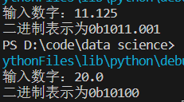

#
2

random.uniform(x, y) 方法将随机生成一个实数，它在 [x,y] 范围内。

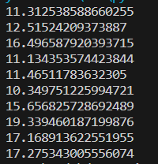

#
3

使用re的match对身份证号的相关位进行匹配，^符号匹配字符串开头，[1-9Xx]确定该位范围，1~9和X和x都可，(7|8|9)是或的关系，括号中隔开的都可以。\d{n}匹配n位数字。$为结尾

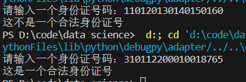

#
4

设计了单链表，定义了节点类和链表类。插入选择头插法。删除节点会判断是否为头尾节点的特殊情况，并且会返回是否删除。find通过循环调用，返回有没有找到。change是在find基础上改变value

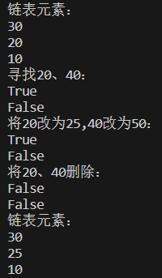

#5

循环输出就好

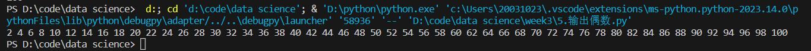

#6

条件判断就好了

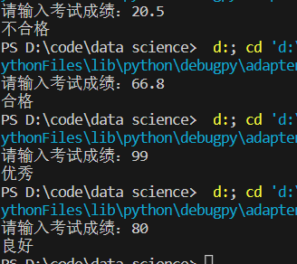

#7

辗转相除法，不断用除数除以余数

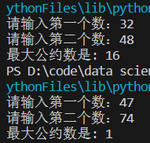

#8

选择排序、快速排序、希尔排序、归并排序这四种排序在低数据量时运行时间数量级差别不大。但是数量在$10^3$级以上时，选择排序的运行时间就变得长多了。

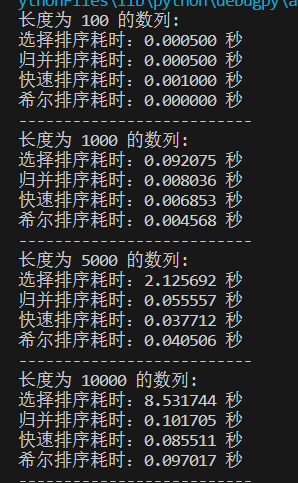

#9

将前缀和数组和后缀和数组先全初始化为1，然后分别从前往后、从后往前更新内容。最后对应位置相乘得到结果。

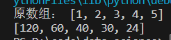

#10

朴素地将2~$\sqrt{n}+1$内的整数除以n一遍

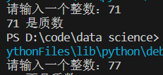

#11

通过调用time.time获取运行开始时间和结束时间，相减获得的结果就是运行时间

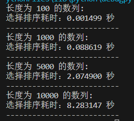

#12

详见流程图

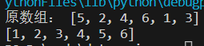

#13

相当于分组的插入排序，分组的gap逐渐减小，时间复杂度可以降低。

希尔排序的时间复杂度是根据步长序列的选择而变化的，最坏情况下的时间复杂度是O(n^2)，平均情况下的时间复杂度介于O(n log n)和O(n^2)之间。

空间复杂度为O(1)，因为希尔排序使用的是原地排序，不需要额外的空间来存储数据。

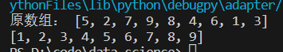