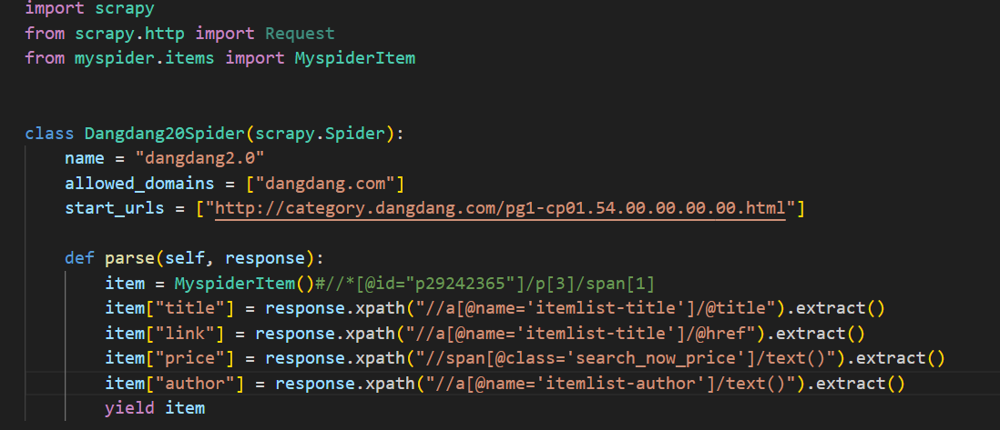
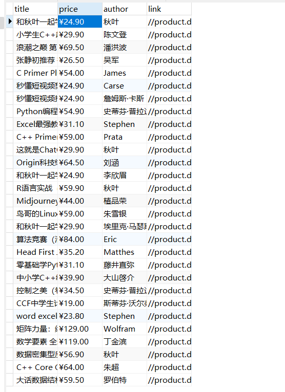

# Readme图片挂了，麻烦看pdf，图片有点多改不过来了

#### 1

、

#### 2

##### Scrapy是一个功能强大的Python爬虫框架，具有以下优点和缺点：

优点：

1. 高效性：Scrapy可以同时处理多个请求，提高爬取效率。
2. 可扩展性：Scrapy提供了丰富的扩展接口和中间件机制，使开发者可以方便地编写和集成自定义的功能和插件。
3. 数据流处理：Scrapy的数据流处理机制使得数据从爬取、处理到存储可以流动，方便处理大量数据。

缺点：

1. 对于简单爬虫可能过于复杂：如果只需要编写简单的爬虫，使用Scrapy可能会显得过于复杂，不太划算。

#### 3

#### 4

#### 5

用pipeline处理了一下数据

，

#### 6下载MySQL

#### 7

#### 8

、

、

、

#### 9

数据不够又加了点

、

#### 10

、

#### 11

、

#### 12

、

#### 13

、

、

#### 14

、

#### 15

、

经验证，正确

