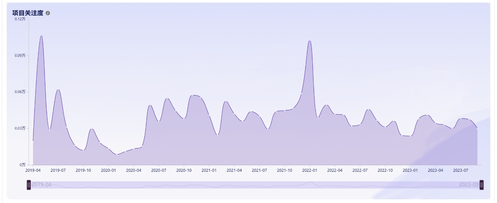
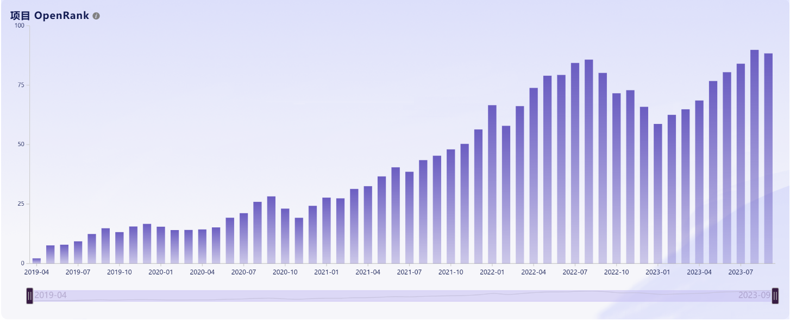
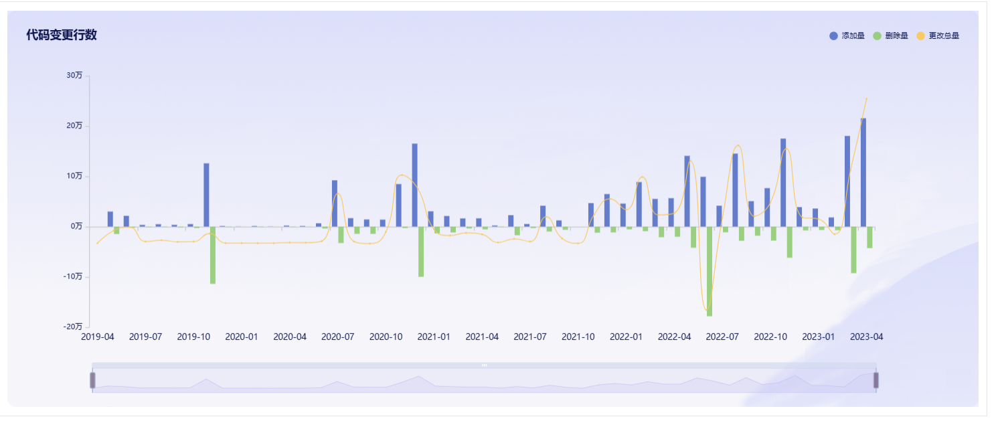
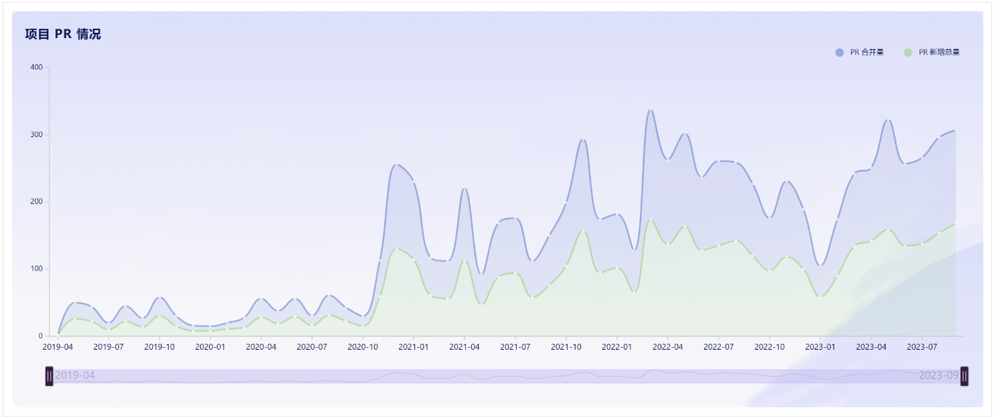
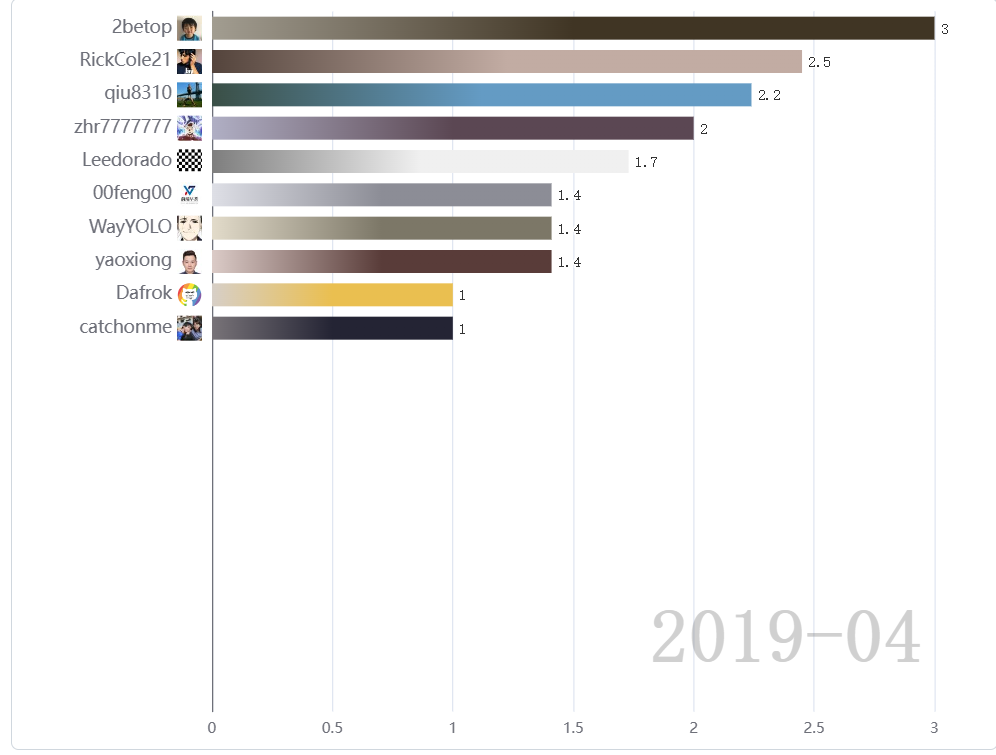
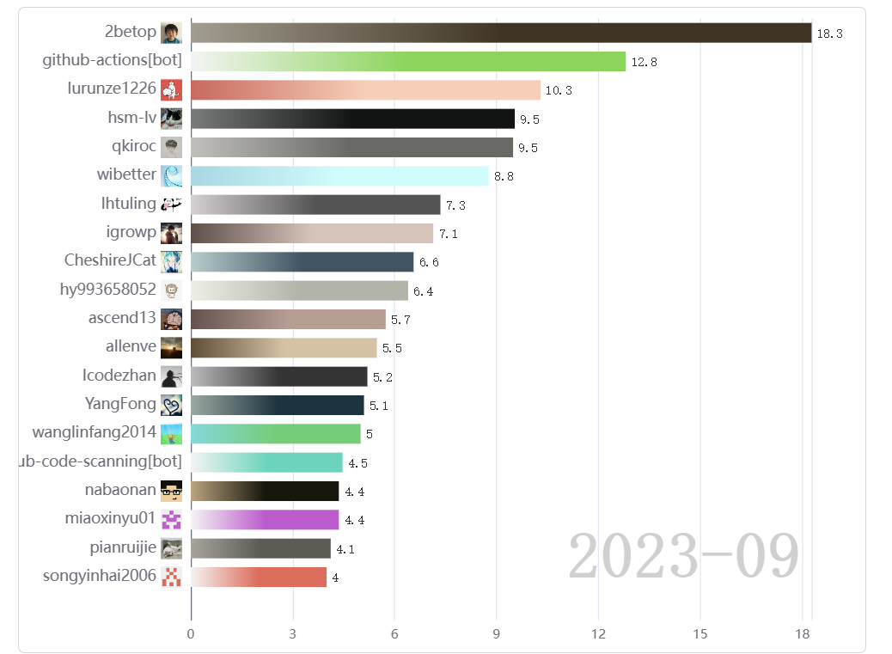
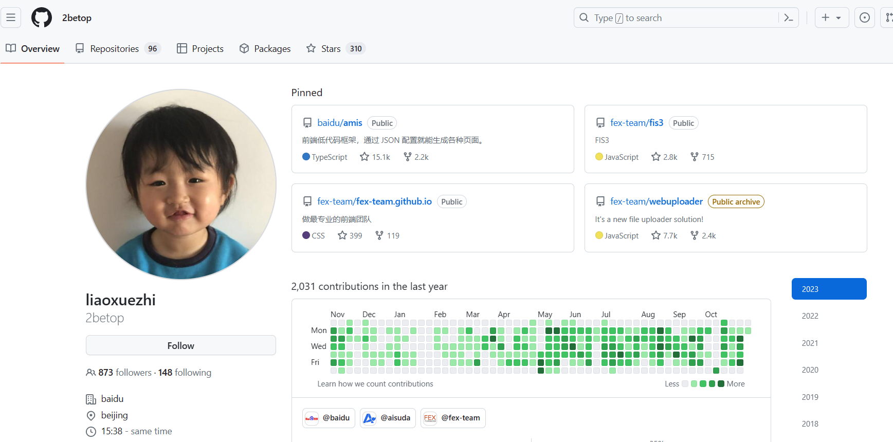
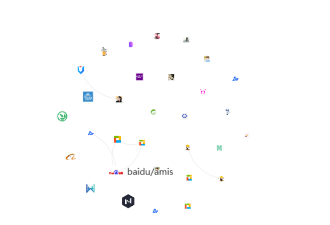
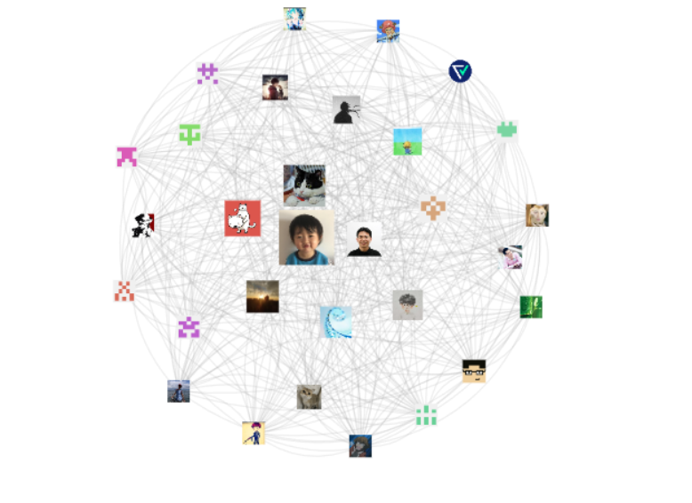

# 通过Hypercrx插件对开源项目分析

## 分析项目：amis

### amis 是百度研发的一个低代码前端框架，它使用 JSON 配置来生成页面，可以减少页面开发工作量，极大提升效率。

### amis洞察大屏：

##### 项目关注度：

​		该项目在诞生之初受到了很多的关注，但是在2019年七月后热度褪去，关注量陡然减少。不过在2020年7月后，项目的关注度有所回升并趋于稳定，在2020年1月时又引发了一次广泛的关注。

##### 项目OpenRank：

​		该项目在诞生之后影响力整体上逐步提升，尽管在2022年末到2023年初有一个小回落，但是这应该是由于其在2022年中期的影响力有异常攀升，该回落是影响力指标重新回归正常的过程。

##### 代码变更数：

​		该项目在诞生之后代码的更改工作逐步增加，可能是随着项目越来越成熟，队伍逐渐壮大，作为一个低代码前端框架，功能增改的任务变得更多。

##### PR情况：

​		从20年10月，贡献者变得更多，项目的PR合并量和PR新增总量都有很大提升，两者变化趋势基本相同。

##### Contributor Activity Racing Bar：

​		贡献者活跃度、数量都有很大提升。

项目的主要负责人一直有很高的活跃度。

##### Project Correlation Network：

##### Active Developer Collaboration Network：

