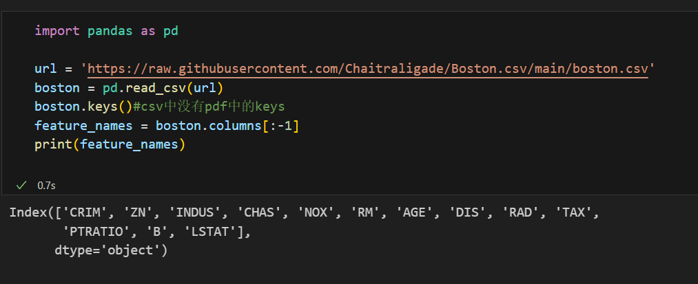
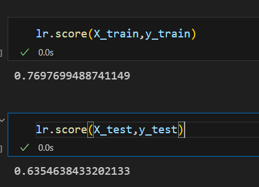
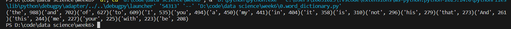
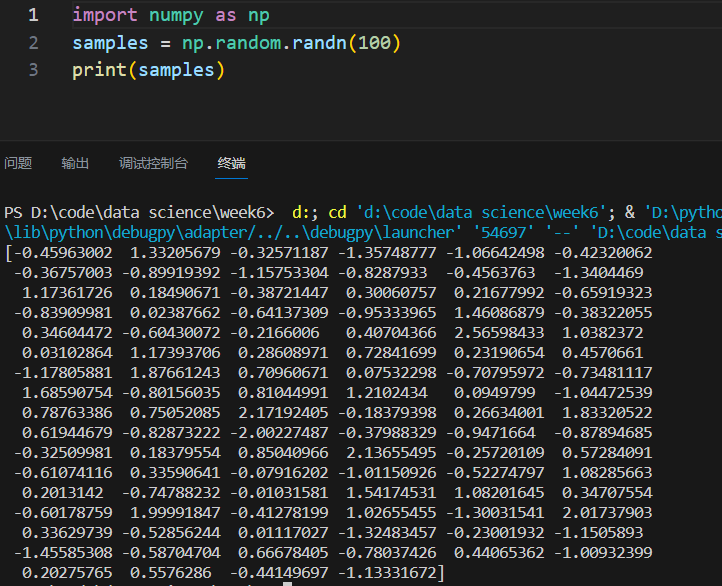
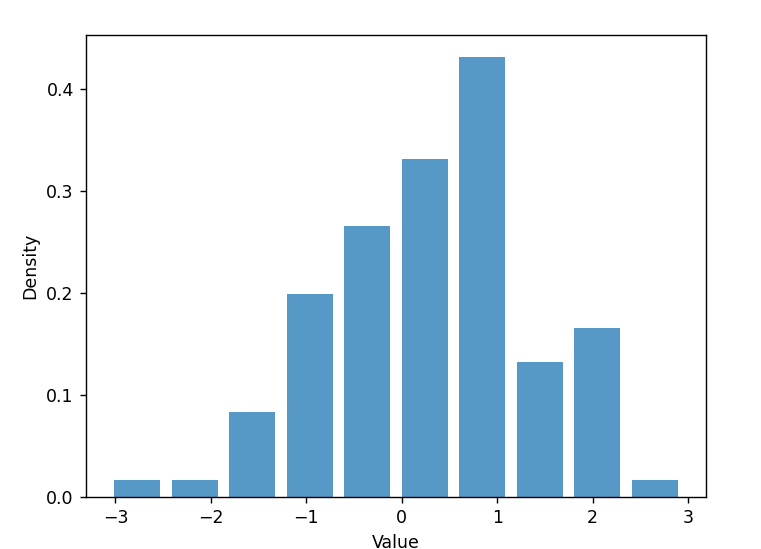
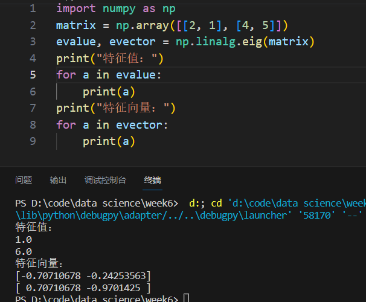
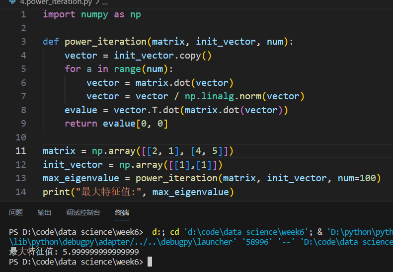
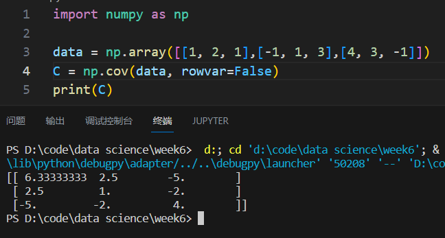
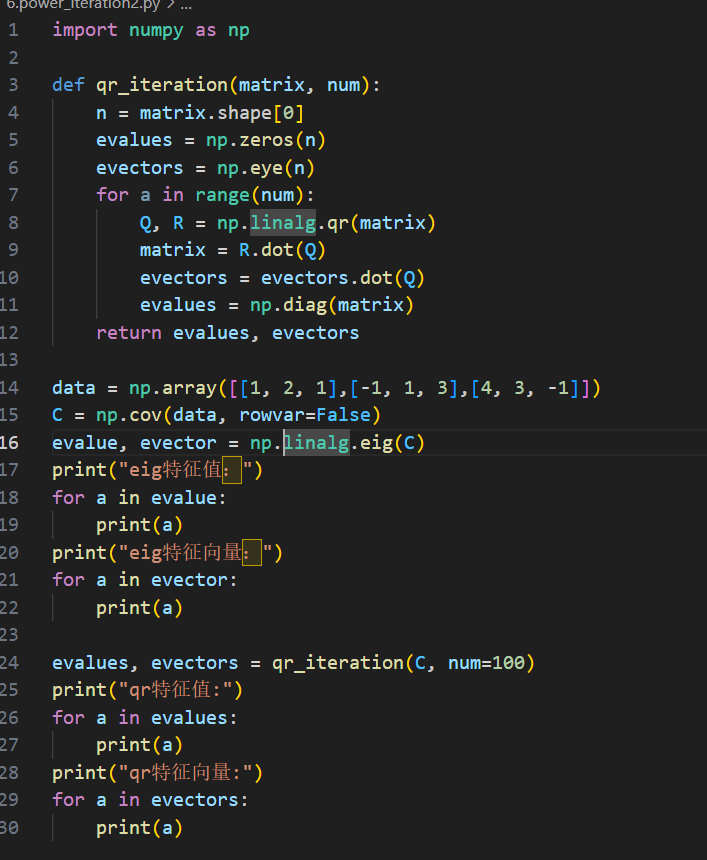
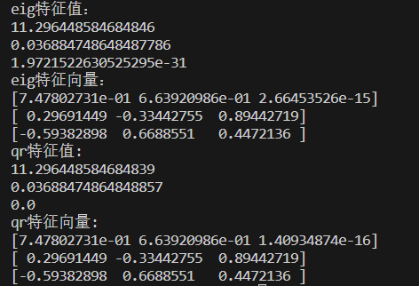

## 10.5实践

#### 线性回归：

#### 字典：

统计的是hamlet

## 践习题

#### 1.

randn会返回标准正态分布的样本

#### 2.

plt函数会使用以下步骤确定区间范围：

1. 找到数据样本中的最小值和最大值。
2. 计算数据的整体范围，即最大值减去最小值。
3. 将整体范围分为指定的条形数目。
4. 每个条形代表一个范围区间，区间的宽度等于整体范围除以条形数目。

(好厉害)

#### 3.

 np.linalg.eig：Compute the eigenvalues and right eigenvectors of a square array.（调包就好）

#### 4.

通过反复将矩阵与一个向量相乘，并归一化得到的向量，逐步逼近矩阵的最大特征值所对应的特征向量。在迭代的过程中，特征向量逐渐收敛到对应于最大特征值的特征向量。最后，通过特征向量的转置与矩阵乘积的形式计算出估计的最大特征值。

#### 5.

当`rowvar=False`时，`np.cov`函数假设每一列代表一个变量，每一行代表一个样本。它会计算每个样本之间的协方差，得到一个矩阵形式的协方差矩阵，其中每个元素表示不同样本之间的协方差。

#### 6.

幂迭代法好像并不适合求全部特征向量和特征值，查阅资料找到了qr算法。

QR分解时，我们将矩阵分解为两个矩阵的乘积：一个正交矩阵Q和一个上三角矩阵R。QR分解的目标是将原始矩阵转化为这种形式，因为R是一个上三角矩阵，它包含了矩阵的特征值，而Q是一个正交矩阵，它包含了矩阵的特征向量。将矩阵A分解为A = QR的形式后，R的对角线元素即为矩阵A的特征值，而Q的列向量即为矩阵A的特征向量

