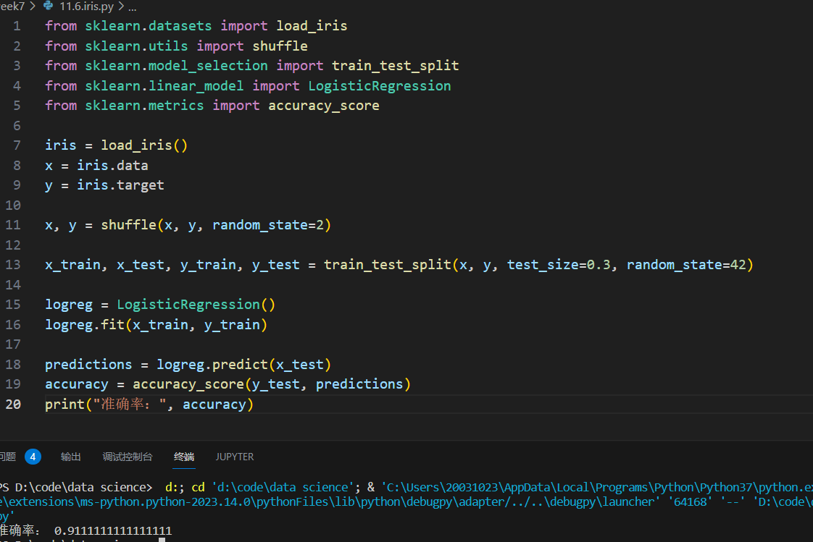
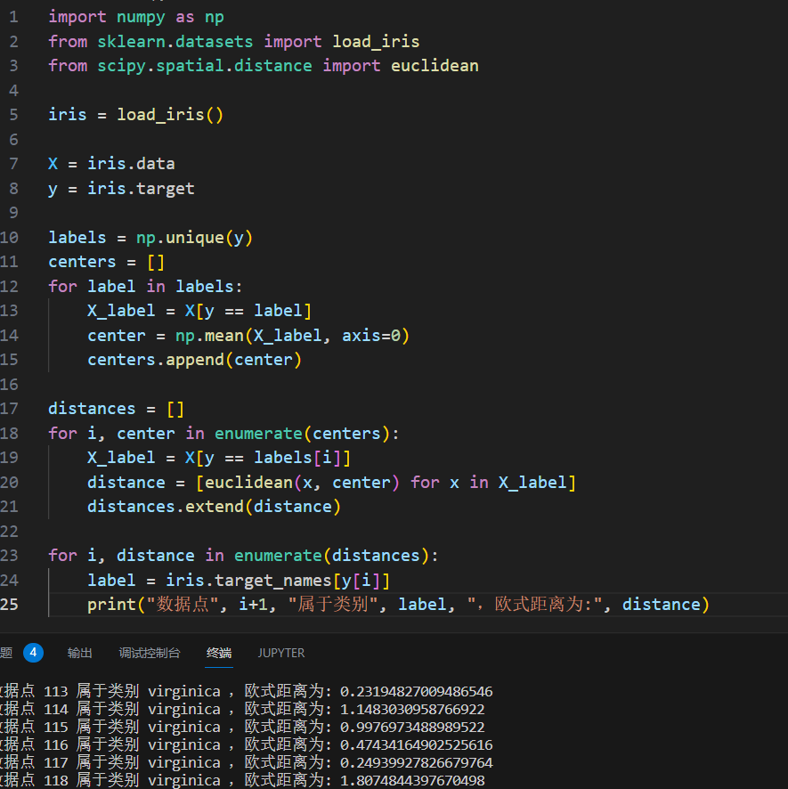
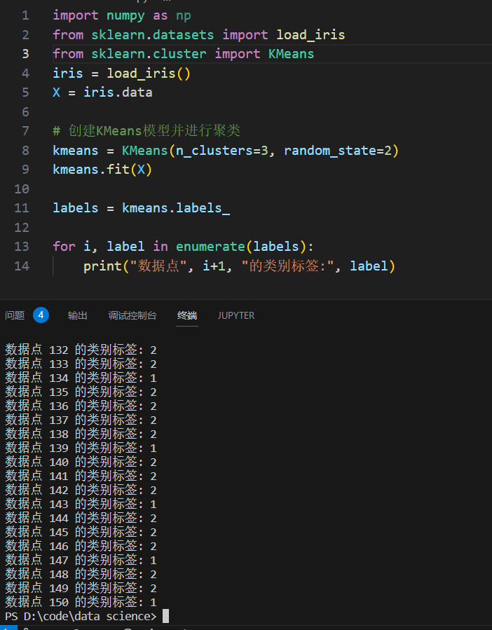
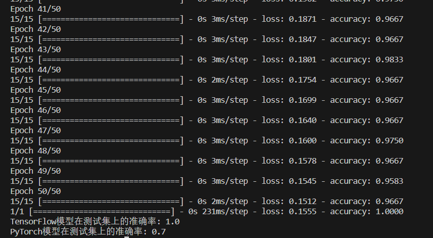
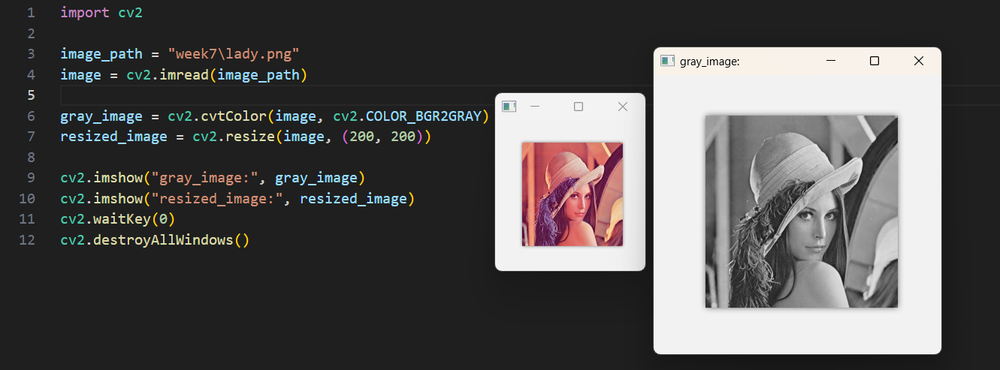
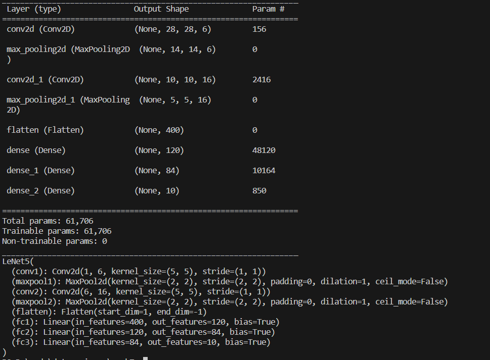
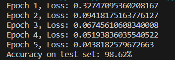
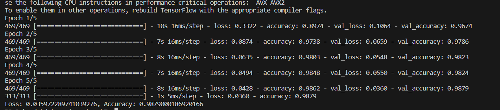

# 第11章

#### 6&7




#### 8




#### 9




# 第12章

#### 4

```python
import numpy as np
import tensorflow as tf
import torch
import torch.nn as nn
import torch.optim as optim
from sklearn.datasets import load_iris
from sklearn.model_selection import train_test_split
from sklearn.preprocessing import OneHotEncoder

# 使用TensorFlow实现神经网络模型
def tensorflow_model():
    iris = load_iris()
    X = iris.data
    y = iris.target.reshape(-1, 1)

    encoder = OneHotEncoder(sparse=False)
    y = encoder.fit_transform(y)

    X_train, X_test, y_train, y_test = train_test_split(X, y, test_size=0.2, random_state=42)

    model = tf.keras.models.Sequential([
        tf.keras.layers.Dense(10, activation='relu', input_shape=(4,)),
        tf.keras.layers.Dense(10, activation='relu'),
        tf.keras.layers.Dense(3, activation='softmax')
    ])

    model.compile(optimizer='adam', loss='categorical_crossentropy', metrics=['accuracy'])
    model.fit(X_train, y_train, epochs=50, batch_size=8, verbose=1)
    _, accuracy = model.evaluate(X_test, y_test)
    print("TensorFlow模型在测试集上的准确率:", accuracy)

# 使用PyTorch实现神经网络模型
def pytorch_model():
    iris = load_iris()
    X = iris.data
    y = iris.target.reshape(-1, 1)

    encoder = OneHotEncoder(sparse=False)
    y = encoder.fit_transform(y)

    X = torch.tensor(X, dtype=torch.float32)
    y = torch.tensor(y, dtype=torch.float32)

    X_train, X_test, y_train, y_test = train_test_split(X, y, test_size=0.2, random_state=42)
    class Net(nn.Module):
        def __init__(self):
            super(Net, self).__init__()
            self.fc1 = nn.Linear(4, 10)
            self.fc2 = nn.Linear(10, 10)
            self.fc3 = nn.Linear(10, 3)

        def forward(self, x):
            x = torch.relu(self.fc1(x))
            x = torch.relu(self.fc2(x))
            x = torch.softmax(self.fc3(x), dim=1)
            return x
        
    model = Net()
    criterion = nn.CrossEntropyLoss()
    optimizer = optim.Adam(model.parameters(), lr=0.001)

    for epoch in range(50):
        optimizer.zero_grad()
        outputs = model(X_train)
        loss = criterion(outputs, torch.max(y_train, 1)[1])
        loss.backward()
        optimizer.step()

    with torch.no_grad():
        outputs = model(X_test)
        _, predicted = torch.max(outputs.data, 1)
        accuracy = (predicted == torch.max(y_test, 1)[1]).sum().item() / y_test.size(0)

    print("PyTorch模型在测试集上的准确率:", accuracy)

if __name__ == '__main__':
    tensorflow_model()
    pytorch_model()
```




#### 5




#### 7

```python
import tensorflow as tf
from tensorflow.keras import layers
import torch
import torch.nn as nn

# 构建LeNet-5模型
model = tf.keras.Sequential()
model.add(layers.Conv2D(6, kernel_size=(5, 5), activation='relu', input_shape=(32, 32, 1)))
model.add(layers.MaxPooling2D(pool_size=(2, 2)))
model.add(layers.Conv2D(16, kernel_size=(5, 5), activation='relu'))
model.add(layers.MaxPooling2D(pool_size=(2, 2)))
model.add(layers.Flatten())
model.add(layers.Dense(120, activation='relu'))
model.add(layers.Dense(84, activation='relu'))
model.add(layers.Dense(10, activation='softmax'))

model.summary()

# 构建LeNet-5模型
class LeNet5(nn.Module):
    def __init__(self):
        super(LeNet5, self).__init__()
        self.conv1 = nn.Conv2d(1, 6, kernel_size=(5, 5), stride=(1, 1))
        self.maxpool1 = nn.MaxPool2d(kernel_size=(2, 2), stride=(2, 2))
        self.conv2 = nn.Conv2d(6, 16, kernel_size=(5, 5), stride=(1, 1))
        self.maxpool2 = nn.MaxPool2d(kernel_size=(2, 2), stride=(2, 2))
        self.flatten = nn.Flatten()
        self.fc1 = nn.Linear(16 * 5 * 5, 120)
        self.fc2 = nn.Linear(120, 84)
        self.fc3 = nn.Linear(84, 10)

    def forward(self, x):
        x = self.conv1(x)
        x = torch.relu(x)
        x = self.maxpool1(x)
        x = self.conv2(x)
        x = torch.relu(x)
        x = self.maxpool2(x)
        x = self.flatten(x)
        x = self.fc1(x)
        x = torch.relu(x)
        x = self.fc2(x)
        x = torch.relu(x)
        x = self.fc3(x)
        return x

model = LeNet5()

print(model)
```




#### 8

###### pytorch：

```python
import torch
import torch.nn as nn
import torch.optim as optim
from torchvision import datasets, transforms

batch_size = 128
epochs = 5
learning_rate = 0.001

transform = transforms.Compose([
    transforms.ToTensor(),
    transforms.Normalize((0.1307,), (0.3081,))
])
train_dataset = datasets.MNIST(root='./data', train=True, transform=transform, download=True)
test_dataset = datasets.MNIST(root='./data', train=False, transform=transform, download=True)
train_loader = torch.utils.data.DataLoader(train_dataset, batch_size=batch_size, shuffle=True)
test_loader = torch.utils.data.DataLoader(test_dataset, batch_size=batch_size, shuffle=False)

# 定义LeNet-5模型
class LeNet5(nn.Module):
    def __init__(self):
        super(LeNet5, self).__init__()
        self.conv1 = nn.Conv2d(1, 6, kernel_size=5)
        self.maxpool1 = nn.MaxPool2d(kernel_size=2)
        self.conv2 = nn.Conv2d(6, 16, kernel_size=5)
        self.maxpool2 = nn.MaxPool2d(kernel_size=2)
        self.fc1 = nn.Linear(16 * 4 * 4, 120)
        self.fc2 = nn.Linear(120, 84)
        self.fc3 = nn.Linear(84, 10)

    def forward(self, x):
        x = self.conv1(x)
        x = torch.relu(x)
        x = self.maxpool1(x)
        x = self.conv2(x)
        x = torch.relu(x)
        x = self.maxpool2(x)
        x = x.view(x.size(0), -1)
        x = self.fc1(x)
        x = torch.relu(x)
        x = self.fc2(x)
        x = torch.relu(x)
        x = self.fc3(x)
        return x

# 创建LeNet-5模型实例
torch_model = LeNet5()

criterion = nn.CrossEntropyLoss()
optimizer = optim.Adam(torch_model.parameters(), lr=learning_rate)

for epoch in range(epochs):
    running_loss = 0.0
    for i, data in enumerate(train_loader, 0):
        inputs, labels = data
        optimizer.zero_grad()
        outputs = torch_model(inputs)
        loss = criterion(outputs, labels)
        loss.backward()
        optimizer.step()
        running_loss += loss.item()
    print(f"Epoch {epoch+1}, Loss: {running_loss/len(train_loader)}")

correct = 0
total = 0
with torch.no_grad():
    for data in test_loader:
        inputs, labels = data
        outputs = torch_model(inputs)
        _, predicted = torch.max(outputs.data, 1)
        total += labels.size(0)
        correct += (predicted == labels).sum().item()

print(f"Accuracy on test set: {100 * correct / total}%")
```





###### tensorflow：

```python
import tensorflow as tf
from tensorflow.keras.datasets import mnist
from tensorflow.keras.models import Sequential
from tensorflow.keras.layers import Conv2D, MaxPooling2D, Flatten, Dense

batch_size = 128
epochs = 5

(x_train, y_train), (x_test, y_test) = mnist.load_data()
x_train = x_train.reshape(-1, 28, 28, 1) / 255.0
x_test = x_test.reshape(-1, 28, 28, 1) / 255.0

# 定义LeNet-5模型
tf_model = Sequential()
tf_model.add(Conv2D(6, kernel_size=(5, 5), activation='relu', input_shape=(28, 28, 1)))
tf_model.add(MaxPooling2D(pool_size=(2, 2)))
tf_model.add(Conv2D(16, kernel_size=(5, 5), activation='relu'))
tf_model.add(MaxPooling2D(pool_size=(2, 2)))
tf_model.add(Flatten())
tf_model.add(Dense(120, activation='relu'))
tf_model.add(Dense(84, activation='relu'))
tf_model.add(Dense(10, activation='softmax'))

tf_model.compile(optimizer='adam',
                 loss='sparse_categorical_crossentropy',
                 metrics=['accuracy'])

tf_model.fit(x_train, y_train, batch_size=batch_size, epochs=epochs, validation_data=(x_test, y_test))

loss, accuracy = tf_model.evaluate(x_test, y_test)
print(f"Loss: {loss}, Accuracy: {accuracy}")
```



