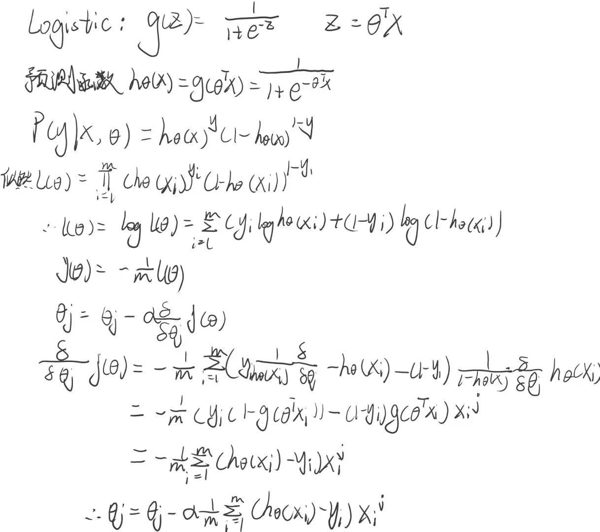

# 第11章

#### 5



#### 6&7


#### 8


#### 9


# 第12章

#### 4

```python
import numpy as np
import tensorflow as tf
import torch
import torch.nn as nn
import torch.optim as optim
from sklearn.datasets import load_iris
from sklearn.model_selection import train_test_split
from sklearn.preprocessing import OneHotEncoder

# 使用TensorFlow实现神经网络模型
def tensorflow_model():
    iris = load_iris()
    X = iris.data
    y = iris.target.reshape(-1, 1)

    encoder = OneHotEncoder(sparse=False)
    y = encoder.fit_transform(y)

    X_train, X_test, y_train, y_test = train_test_split(X, y, test_size=0.2, random_state=42)

    model = tf.keras.models.Sequential([
        tf.keras.layers.Dense(10, activation='relu', input_shape=(4,)),
        tf.keras.layers.Dense(10, activation='relu'),
        tf.keras.layers.Dense(3, activation='softmax')
    ])

    model.compile(optimizer='adam', loss='categorical_crossentropy', metrics=['accuracy'])
    model.fit(X_train, y_train, epochs=50, batch_size=8, verbose=1)
    _, accuracy = model.evaluate(X_test, y_test)
    print("TensorFlow模型在测试集上的准确率:", accuracy)

# 使用PyTorch实现神经网络模型
def pytorch_model():
    iris = load_iris()
    X = iris.data
    y = iris.target.reshape(-1, 1)

    encoder = OneHotEncoder(sparse=False)
    y = encoder.fit_transform(y)

    X = torch.tensor(X, dtype=torch.float32)
    y = torch.tensor(y, dtype=torch.float32)

    X_train, X_test, y_train, y_test = train_test_split(X, y, test_size=0.2, random_state=42)
    class Net(nn.Module):
        def __init__(self):
            super(Net, self).__init__()
            self.fc1 = nn.Linear(4, 10)
            self.fc2 = nn.Linear(10, 10)
            self.fc3 = nn.Linear(10, 3)

        def forward(self, x):
            x = torch.relu(self.fc1(x))
            x = torch.relu(self.fc2(x))
            x = torch.softmax(self.fc3(x), dim=1)
            return x
        
    model = Net()
    criterion = nn.CrossEntropyLoss()
    optimizer = optim.Adam(model.parameters(), lr=0.001)

    for epoch in range(50):
        optimizer.zero_grad()
        outputs = model(X_train)
        loss = criterion(outputs, torch.max(y_train, 1)[1])
        loss.backward()
        optimizer.step()

    with torch.no_grad():
        outputs = model(X_test)
        _, predicted = torch.max(outputs.data, 1)
        accuracy = (predicted == torch.max(y_test, 1)[1]).sum().item() / y_test.size(0)

    print("PyTorch模型在测试集上的准确率:", accuracy)

if __name__ == '__main__':
    tensorflow_model()
    pytorch_model()
```


#### 5


#### 7

```python
import tensorflow as tf
from tensorflow.keras import layers
import torch
import torch.nn as nn

# 构建LeNet-5模型
model = tf.keras.Sequential()
model.add(layers.Conv2D(6, kernel_size=(5, 5), activation='relu', input_shape=(32, 32, 1)))
model.add(layers.MaxPooling2D(pool_size=(2, 2)))
model.add(layers.Conv2D(16, kernel_size=(5, 5), activation='relu'))
model.add(layers.MaxPooling2D(pool_size=(2, 2)))
model.add(layers.Flatten())
model.add(layers.Dense(120, activation='relu'))
model.add(layers.Dense(84, activation='relu'))
model.add(layers.Dense(10, activation='softmax'))

model.summary()

# 构建LeNet-5模型
class LeNet5(nn.Module):
    def __init__(self):
        super(LeNet5, self).__init__()
        self.conv1 = nn.Conv2d(1, 6, kernel_size=(5, 5), stride=(1, 1))
        self.maxpool1 = nn.MaxPool2d(kernel_size=(2, 2), stride=(2, 2))
        self.conv2 = nn.Conv2d(6, 16, kernel_size=(5, 5), stride=(1, 1))
        self.maxpool2 = nn.MaxPool2d(kernel_size=(2, 2), stride=(2, 2))
        self.flatten = nn.Flatten()
        self.fc1 = nn.Linear(16 * 5 * 5, 120)
        self.fc2 = nn.Linear(120, 84)
        self.fc3 = nn.Linear(84, 10)

    def forward(self, x):
        x = self.conv1(x)
        x = torch.relu(x)
        x = self.maxpool1(x)
        x = self.conv2(x)
        x = torch.relu(x)
        x = self.maxpool2(x)
        x = self.flatten(x)
        x = self.fc1(x)
        x = torch.relu(x)
        x = self.fc2(x)
        x = torch.relu(x)
        x = self.fc3(x)
        return x

model = LeNet5()

print(model)
```


#### 8

###### pytorch：

```python
import torch
import torch.nn as nn
import torch.optim as optim
from torchvision import datasets, transforms

batch_size = 128
epochs = 5
learning_rate = 0.001

transform = transforms.Compose([
    transforms.ToTensor(),
    transforms.Normalize((0.1307,), (0.3081,))
])
train_dataset = datasets.MNIST(root='./data', train=True, transform=transform, download=True)
test_dataset = datasets.MNIST(root='./data', train=False, transform=transform, download=True)
train_loader = torch.utils.data.DataLoader(train_dataset, batch_size=batch_size, shuffle=True)
test_loader = torch.utils.data.DataLoader(test_dataset, batch_size=batch_size, shuffle=False)

# 定义LeNet-5模型
class LeNet5(nn.Module):
    def __init__(self):
        super(LeNet5, self).__init__()
        self.conv1 = nn.Conv2d(1, 6, kernel_size=5)
        self.maxpool1 = nn.MaxPool2d(kernel_size=2)
        self.conv2 = nn.Conv2d(6, 16, kernel_size=5)
        self.maxpool2 = nn.MaxPool2d(kernel_size=2)
        self.fc1 = nn.Linear(16 * 4 * 4, 120)
        self.fc2 = nn.Linear(120, 84)
        self.fc3 = nn.Linear(84, 10)

    def forward(self, x):
        x = self.conv1(x)
        x = torch.relu(x)
        x = self.maxpool1(x)
        x = self.conv2(x)
        x = torch.relu(x)
        x = self.maxpool2(x)
        x = x.view(x.size(0), -1)
        x = self.fc1(x)
        x = torch.relu(x)
        x = self.fc2(x)
        x = torch.relu(x)
        x = self.fc3(x)
        return x

# 创建LeNet-5模型实例
torch_model = LeNet5()

criterion = nn.CrossEntropyLoss()
optimizer = optim.Adam(torch_model.parameters(), lr=learning_rate)

for epoch in range(epochs):
    running_loss = 0.0
    for i, data in enumerate(train_loader, 0):
        inputs, labels = data
        optimizer.zero_grad()
        outputs = torch_model(inputs)
        loss = criterion(outputs, labels)
        loss.backward()
        optimizer.step()
        running_loss += loss.item()
    print(f"Epoch {epoch+1}, Loss: {running_loss/len(train_loader)}")

correct = 0
total = 0
with torch.no_grad():
    for data in test_loader:
        inputs, labels = data
        outputs = torch_model(inputs)
        _, predicted = torch.max(outputs.data, 1)
        total += labels.size(0)
        correct += (predicted == labels).sum().item()

print(f"Accuracy on test set: {100 * correct / total}%")
```


###### tensorflow：

```python
import tensorflow as tf
from tensorflow.keras.datasets import mnist
from tensorflow.keras.models import Sequential
from tensorflow.keras.layers import Conv2D, MaxPooling2D, Flatten, Dense

batch_size = 128
epochs = 5

(x_train, y_train), (x_test, y_test) = mnist.load_data()
x_train = x_train.reshape(-1, 28, 28, 1) / 255.0
x_test = x_test.reshape(-1, 28, 28, 1) / 255.0

# 定义LeNet-5模型
tf_model = Sequential()
tf_model.add(Conv2D(6, kernel_size=(5, 5), activation='relu', input_shape=(28, 28, 1)))
tf_model.add(MaxPooling2D(pool_size=(2, 2)))
tf_model.add(Conv2D(16, kernel_size=(5, 5), activation='relu'))
tf_model.add(MaxPooling2D(pool_size=(2, 2)))
tf_model.add(Flatten())
tf_model.add(Dense(120, activation='relu'))
tf_model.add(Dense(84, activation='relu'))
tf_model.add(Dense(10, activation='softmax'))

tf_model.compile(optimizer='adam',
                 loss='sparse_categorical_crossentropy',
                 metrics=['accuracy'])

tf_model.fit(x_train, y_train, batch_size=batch_size, epochs=epochs, validation_data=(x_test, y_test))

loss, accuracy = tf_model.evaluate(x_test, y_test)
print(f"Loss: {loss}, Accuracy: {accuracy}")
```


#### 手写汉字识别

​	这个代码是我在github上找到的，并且难得的是经过我对代码的修改，总算能在cuda、cudnn、tensorflow版本都合适的情况下运行（我先前试过的三四个project在linux虚拟机跑、非虚拟环境跑都不成功）。我会对其进行适当解读。

首先看模型：

​	该模型采用了经典的卷积神经网络架构，包含多个卷积层和池化层。这种架构在图像分类任务中表现良好。

```python
def GetModel_V1(input_shape, class_num, is_training=True):
    input_ = tf.keras.Input(shape=input_shape) #输入层：接受输入数据的形状为 input_shape 的张量。

    #卷积层 1：使用 7x7 的卷积核，步长为 2，在填充方式上采用了 "SAME"，并使用 ReLU 激活函数。输出结果形状为 (None, H/2, W/2, 64)，其中 H 和 W 分别表示输入数据的高度和宽度。
    conv1 = tf.keras.layers.Conv2D(64, 7, 2, 'SAME', activation='relu')(input_)
    #池化层 1：采用默认参数的最大池化操作，对卷积层 1 的输出进行下采样，输出结果形状为 (None, H/4, W/4, 64)。
    pool1 = tf.keras.layers.MaxPooling2D()(conv1)
    #卷积层 2：使用 3x3 的卷积核，步长为 2，在填充方式上采用了 "SAME"，并使用 ReLU 激活函数。输出结果形状为 (None, H/8, W/8, 256)。
    conv2 = tf.keras.layers.Conv2D(256, 3, 2, 'SAME', activation='relu')(pool1)
    #池化层 2：采用默认参数的最大池化操作，对卷积层 2 的输出进行下采样，输出结果形状为 (None, H/16, W/16, 256)。
    pool2 = tf.keras.layers.MaxPooling2D()(conv2)
    #卷积层 3：使用 3x3 的卷积核，步长为 2，在填充方式上采用了 "SAME"，并使用 ReLU 激活函数。输出结果形状为 (None, H/32, W/32, 512)。
    conv3 = tf.keras.layers.Conv2D(512, 3, 2, 'SAME', activation='relu')(pool2)
    #池化层 3：采用默认参数的平均池化操作，对卷积层 3 的输出进行下采样，输出结果形状为 (None, H/32, W/32, 512)。
    pool3 = tf.keras.layers.AveragePooling2D()(conv3)

    #展平层：将池化层 3 的输出结果展平为形状为 (None, H/32 * W/32 * 512) 的向量。
    flat = tf.keras.layers.Flatten()(pool3)
    #全连接层：使用 softmax 激活函数，将展平层的输出映射到长度为 class_num 的向量，表示不同类别的概率分布。
    output = tf.keras.layers.Dense(class_num, activation='softmax')(flat)

    model = tf.keras.Model(inputs=input_, outputs=output)
    model.summary()  # 将模型信息输出到终端
    return model
```


然后就是训练的部分：

```python
from config import *
import tensorflow as tf
import tfrecord_loader
import model
import func
import numpy as np
import os

isTraining = True
train_dataset_path = 'TFRecord'

train_dataset = tfrecord_loader.GetDataset(train_dataset_path)
w2i, i2w = func.get_w2i_dict()

print(tf.config.list_logical_devices('GPU'))

MyMod = model.GetModel_V1((resize_scale, resize_scale, 1), len(w2i), isTraining)  # 获取模型
optimizer = tf.keras.optimizers.RMSprop()  # 定义优化器

# if os.path.exists(weight_path):
#     MyMod.load_weights(weight_path)  # 加载权重

@tf.function() #使用 @tf.function() 装饰器将 train() 函数转换为 TensorFlow 计算图。
def train(datas, labels):  # 训练函数
    with tf.GradientTape() as Tape:  # 自动记录梯度
        output = MyMod(datas)  # 前向传播
        losses = tf.reduce_mean(tf.keras.losses.sparse_categorical_crossentropy(labels, output))  # 计算 loss
    grad = Tape.gradient(losses, MyMod.trainable_variables)  # 获取梯度
    optimizer.apply_gradients(zip(grad, MyMod.trainable_variables))  # 传播梯度
    return losses  # 返回 loss 值

if isTraining:
    try:
        for eps in range(epochs):
            for i, (datas, labels) in enumerate(train_dataset):
                if i % 10000 == 0:  # 10000 次 保存一下权重
                    MyMod.save_weights(weight_path)
                loss = train(datas, labels)
                if i % 200 == 0:  # 200次输出一下loss和这一轮的准确率
                    y_pred = MyMod(datas)
                    acc = tf.reduce_sum(tf.cast(tf.equal(labels, tf.argmax(y_pred, 1)), tf.float64)) / len(labels)
                    print('epoch: %d, step: %d, loss:%.2f, acc = %.2f%%' % (eps, i, loss.numpy(), acc.numpy() * 100))
    except KeyboardInterrupt:
        MyMod.save_weights(weight_path)  # Ctrl + C 时保存模型
```

​	这个模型跑下来是有可能不收敛的，但是只出现过一次，不排除是环境问题。准确率最后能达到85%左右。不过这个模型比较大，数据比较大（疯狂占用内存，IO频繁，gpu占用倒是不高），我的4060ti 16g似乎都得跑十分钟以上。（建议以后的课就数字识别，不知道没有独显的同学怎么实现的这个project，毕竟数据集比较大，租服务器应该也不是很方便）


